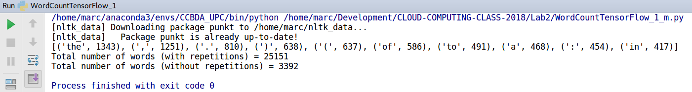
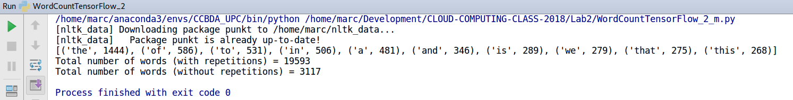
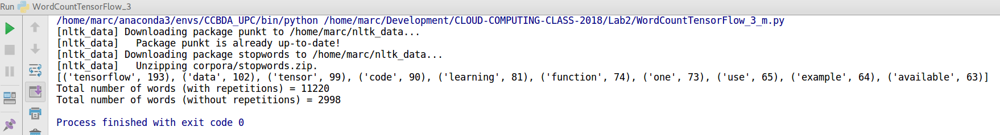
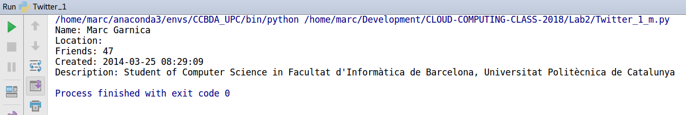
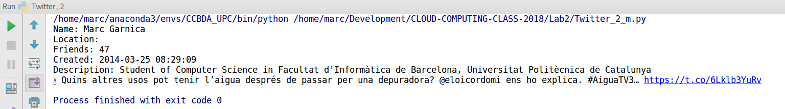

# Lab session #2: Doors in the cloud

Course link: [ccbda-upc.github.io](https://ccbda-upc.github.io/).
Group 1207

-   Quang Duy Tran - duy9968\@gmail.com

-   Marc Garnica Caparros - marcgarnicacaparros\@gmail.com

Assignment link: [Lab 2 Assignment](https://github.com/CCBDA-UPC/Assignments-2018/blob/master/Lab02.md)

## Objectives

The following README summarizes the tasks done during the second lab session
of the Cloud Computing for Big Data Analytics course in Universitat Politècnica
de Catalunya. For project delivery and recovery of information during the course evolution.


### Pre-lab homeworks

-   Registering our app on twitter for accessing the API (Application Programming Interface)
in http://apps.twitter.com

### Lab tasks

- [x] NLTK package setup. Python package for Natural Language Processing. It does not only include algorithms but also linguistic data.
- [x] **Task 2.1.1** [First script]() using NLTK: Tokenizing the whole .txt file, counting the tokens and printing the 10 most common, also printing the total number of words in the file (with and without repetitions)



- [x] **Task 2.1.2** [Second script]() modifying the first one. In this case removing the punctuation from the tokens set.




- [x] **Task 2.1.3** For a better analysis of the words used in the file, it is also possible to remove the Stop Words, words language-dependent that are highly used without adding semantic meaning to the context. [Third Script]().



- [x] Tweepy setup on the python environment. Package to access Twitter data.
- [x] Getting the Twitter credentials from the twitter app created previously.
- [x] Protecting our credentials for being public with environment variables through Pycharm >> Edit configurations. And adding this into the code:

```python
import os

#Credential setup
auth = OAuthHandler(os.environ['CONSUMER_KEY'], os.environ['CONSUMER_SECRET'])
auth.set_access_token(os.environ['ACCESS_TOKEN'], os.environ['ACCESS_SECRET'])
```

**os.environ[key]** returns the value of that certain key in the Environment Variables configuration.

- [x] Accessing profile data with tweepy with [Twitter_1.py]() script.



- [x] Tweets data can be accessed in multiple ways.
   -   Accessing one tweet text:

   

   -   Printing the json format of a tweet status: [tweet_status.json](tweet_status.json).
   -   Printing the json format of 10 friend in the twiteer profile: [tw_friends.json](tw_friends.json).
   -   Analysing the json format of our own tweets: [tweet.json](tweet.json).
 
