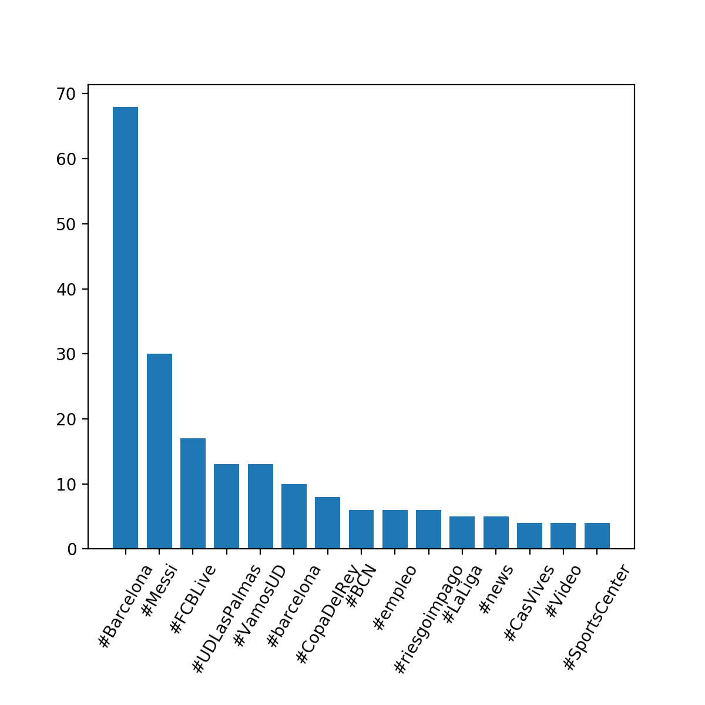

# Lab session #3: Extracting and Analyzing data from the Cloud

Course link: [ccbda-upc.github.io](https://ccbda-upc.github.io/).

Group 1207

-   Quang Duy Tran - duy9968\@gmail.com

-   Marc Garnica Caparros - marcgarnicacaparros\@gmail.com

Assignment link: [Lab 3 Assignment](https://github.com/CCBDA-UPC/Assignments-2018/blob/master/Lab03.md)

## Objectives

The following README summarizes the tasks done during the third lab session
of the Cloud Computing for Big Data Analytics course in Universitat Politècnica
de Catalunya. For project delivery and recovery of information during the course evolution.
This session introduces the basics for extracting appealing terms from a dataset of tweets while keeping an open connection gathering the streaming and upcoming tweets about a particular track or filter.

### Pre-lab homeworks

-   This lab assignment had no pre-tasks because it is build on the previous one ([see here](https://github.com/duy-tran/CLOUD-COMPUTING-CLASS-2018/tree/master/Lab2)).

### Lab tasks

-  [x] Set up and open connection with Twitter API, using the Real-time Tweets API. The Real-time tweets API of twitter is preferred over the common REST API if we want to perform singular searches. With the open real-time connection we are able to get massive amount of data without exceeding the rate limits. In this case we are storing the tweets from a single filter in a file. The keyword for the filter and the name of the file are stored as environment parameters and can be accessed in the code by:

```python
import os

filterKW = os.environ['FILTER_KW']
fileName = os.environ['FILENAME']
```
Each line of the file contains a tweet containing the filter keyword on its text. The listener script can be found in the repository in [Listener.py](Listener.py)

- [x] Analyzing the tweets: Counting the terms present on the tweets stored by the process explained in the previous point. We assume all the tweets we want to analyze have been previoulsy saved in a file. The program [TwitterAnalyzer.py](TwitterAnalyzer.py) is opening the file containing the tweets and preprocessing their text to finally count the appearance of each word. As it was studied on the previous lab session, we deleted the common English and Catalan stopwords and also the punctuation.

    Different analysis have been performed, on one side, tracking the word Analytics, the listener script produced the file [AnalyticsTweets.json](AnalyticsTweets.json) And the result was the following:

        -------RESULT-------
        Top 10 token appearences -> [(':', 1367), ('…', 1192), ('RT', 1051), ('to', 625), ('the', 590), ('.', 478), (',', 419), ('and', 364), ('Analytics', 306), ('#BigData', 289)]
        Top 10 word appearences (without stopwords) -> [('Analytics', 306), ('A', 247), ('Data', 194), ('Big', 162), ('analytics', 161), ('Infographic', 159), ('want', 143), ('Financial', 138), ('Services', 136), ('move', 134)]
        Top 10 hashtag appearences -> [('#BigData', 289), ('#IoT', 236), ('#AI', 186), ('#', 172), ('#IIoT', 160), ('#InternetOfThings', 141), ('#Analytics', 141), ('#Cloud', 139), ('#Healthcare', 137), ('#VR', 130)]
        Top 10 mention appearences -> [('@Fisher85M', 144), ('@frankcausa', 126), ('@ManjeetRege', 69), ('@granvilleDSC', 56), ('@FortniteGame', 28), ('@Ronald_vanLoon', 28), ('@Peerbits', 26), ('@TimesNow', 19), ('@forsungwoon_th', 18), ('@', 14)]

    We also analyzed the track of "ArtificialIntelligence" creating the file [ArtificialIntelligenceTweets.json](ArtificialIntelligenceTweets.json) and the following results:

          -------RESULT-------
          Top 10 token appearences -> [(':', 281), ('…', 226), ('RT', 205), (',', 89), ('@Ronald_vanLoon', 71), ('to', 64), ('by', 61), ('the', 60), ('.', 59), ('#MachineLearning', 49)]
          Top 10 word appearences (without stopwords) -> [('Read', 46), ('How', 44), ('’', 41), ('drives', 36), ('big', 36), ('benefits', 35), ('https://t.co/Gj3l8hTk', 35), ('Intel', 27), ('Talks', 26), ('Chief', 26)]
          Top 10 hashtag appearences -> [('#MachineLearning', 49), ('#AI', 45), ('#ArtificialIntelligence', 39), ('#business', 35), ('#Artificial', 26), ('#AugmentedIntelligence', 26), ('#artificialintelligence', 19), ('#DataScientist', 18), ('#BigData', 12), ('#Artificialintelligence', 10)]
          Top 10 mention appearences -> [('@Ronald_vanLoon', 71), ('@benjaminroussey', 35), ('@techgenix', 35), ('@SachinLulla', 8), ('@kdnuggets', 8), ('@mclynd', 8), ('@VertiAI', 4), ('@ai_expo', 4), ('@rwang0', 4), ('@stpiindia', 3)]

- [x] **Case study** Using the Lab3.CaseStudy.json dataset we analyzed the data contained and plot it in the following image:

<p align="center">
  
</p>

As we can really see from the picture and the most common hashtags observed, the city of barcelona is mainly quoted on Twitter feed due to the football team Futbol Club Barcelona. Even though being huge football fans in this group, we agree that Barcelona has way much more interesting things to be known about.

- [x] **Student proposal:** Last but not least, we implemented a short but detailed analysis on the appearance of the word _Madrid_ in twitter data. Our first objective was to identify where the main sources of data were linked with the city of Madrid and what was more interesting how this was compared to the Barcelona data set used in the case study. We used the knowledge obtained from this session:
   - [Listener.py](Listener.py) configured to track _Madrid_ and store the tweets in the file [Madrid.json](Madrid.json).
   - [StudentProposal_analysis.py](StudentProposal_analysis.py) is opening the file and counting the interesting terms and hashtags present in the tweet text.

   We adjusted the stopwords list for our interests as it follows:
   ```python
   nltk.download("stopwords") # download the stopword corpus on our computer

   punctuation = list(string.punctuation)
   stop = stopwords.words('english') + stopwords.words('spanish') + punctuation + ['rt', 'via', 'RT', '…', '#', 'ี', '️', '¿', '¡', '’']

   ```

   - Finally this was the analysis extracted from the data.

          ------RESULT-------
          Number of tweets analyzed: 11529
         Top 10 token appearences -> [(':', 9983), ('de', 9107), ('RT', 7883), ('…', 7544), ('.', 6431), ('Madrid', 5999), (',', 5657), ('en', 4814), ('la', 4411), ('a', 4297)]
         Top 20 word appearences (without stopwords) -> [('madrid', 6501), ('real', 2014), ('ón', 1460), ('á', 672), ('barcelona', 643), ('ó', 620), ('ña', 614), ('ía', 599), ('é', 593), ('est', 590), ('espa', 583), ('si', 582), ('😂', 541), ('cifuentes', 524), ('whatsapp', 515), ('pique', 442), ('players', 396), ('gerard', 373), ('julio', 355), ('comunidad', 349)]
         Top 20 hashtag appearences -> [('#Madrid', 538), ('#LaliEnVivo', 331), ('#Aena', 148), ('#Barcelona', 122), ('#PlenoMadrid', 83), ('#20m', 75), ('#madrid', 63), ('#Lalienvivo', 51), ('#ÚltimaHora', 45), ('#policiademadridbajominimos', 44), ('#Lavapiés', 42), ('#cifuentes', 39), ('#empleo', 37), ('#LaRazónTv', 30), ('#EquiparaciónYA', 30), ('#trabajo', 30), ('#Nuestros11Romanticos', 28), ('#GerardPiq', 25), ('#RealMadrid', 24), ('#ÚLTIMAHORA', 24)]
         Top 20 mention appearences -> [('@laliespos', 476), ('@brfootball', 210), ('@ccifuentes', 196), ('@javierbarberog', 159), ('@Asl_MCMXCIII', 150), ('@MADRID', 148), ('@eldiarioes', 124), ('@begonavillacis', 123), ('@AhoraMadrid', 121), ('@RMadrid_FR', 106), ('@policiademadrid', 101), ('@TonyAguilarOfi', 101), ('@GoalsGif', 99), ('@ManuelaCarmena', 95), ('@CuriosodeFutbol', 91), ('@InfosFuteboI', 91), ('@40GlobalShow', 88), ('@Cs_Madrid', 87), ('@jorgepsuv', 75), ('@PabloMM', 74)]
         ('#Madrid', '#LaliEnVivo', '#Aena', '#Barcelona', '#PlenoMadrid', '#20m', '#madrid', '#Lalienvivo', '#ÚltimaHora', '#policiademadridbajominimos', '#Lavapiés', '#cifuentes', '#empleo', '#LaRazónTv', '#EquiparaciónYA', '#trabajo', '#Nuestros11Romanticos', '#GerardPiq', '#RealMadrid', '#ÚLTIMAHORA') (538, 331, 148, 122, 83, 75, 63, 51, 45, 44, 42, 39, 37, 30, 30, 30, 28, 25, 24, 24)


<p align="center">
     
</p>

   Comparing to the previous example of analyzing the word _Barcelona,_ it is showed that tweets regarding _Madrid_ has a wider range of interests, from music to politics, while hashtag of the famous football team Real Madrid is ranked low in the chart. Can it be that Madrid is more than football team, while Barcelona is eclipsed by the sports comunity? Or this is only a fact that FCBarcelona has way more international impact than Real Madrid?

   Interestingly, #Barcelona and #GerardPiq (Gerard Pique is an FC Barcelona's player) made to the list, this can be due to the rivalry between the two greatest clubs in Spain (or in the world).
