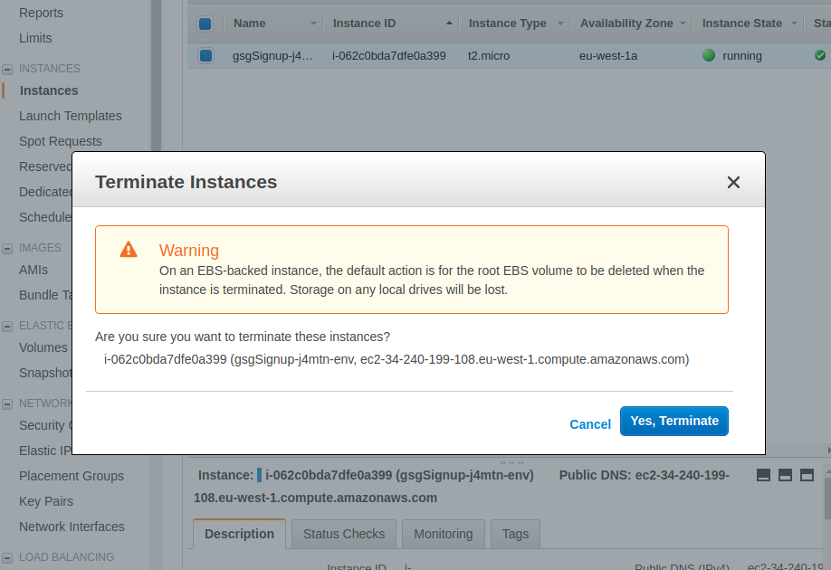
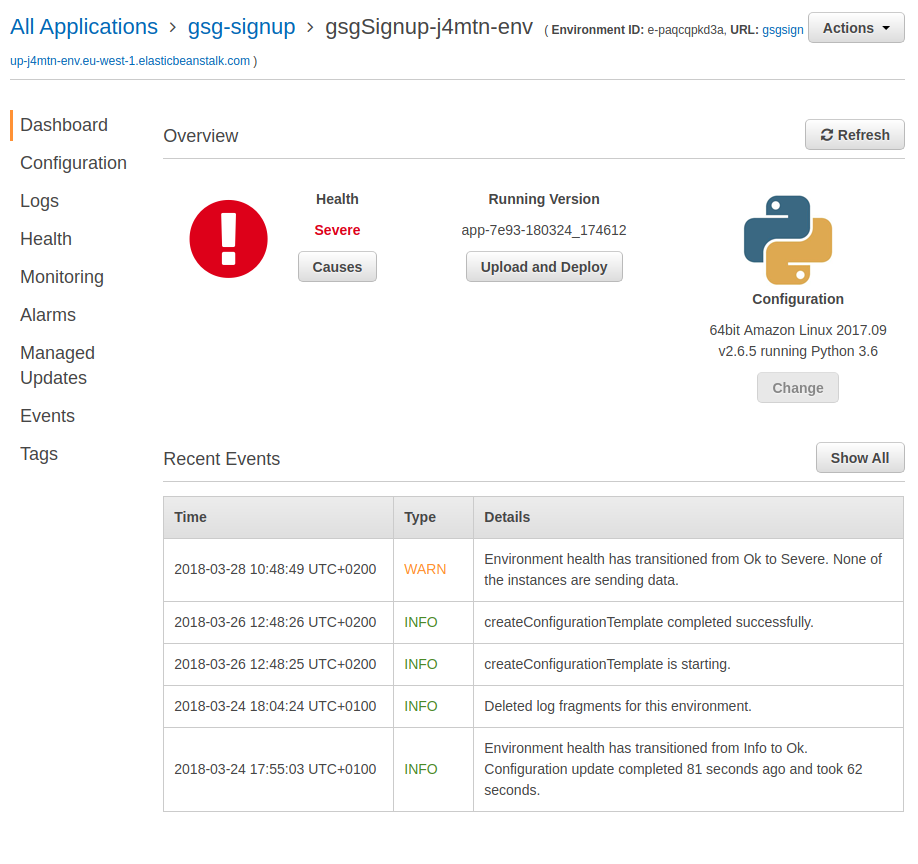
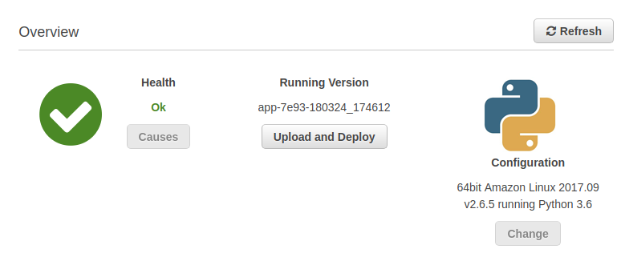
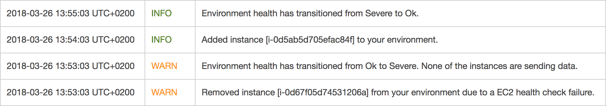
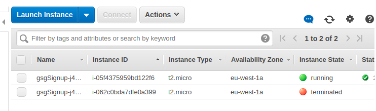
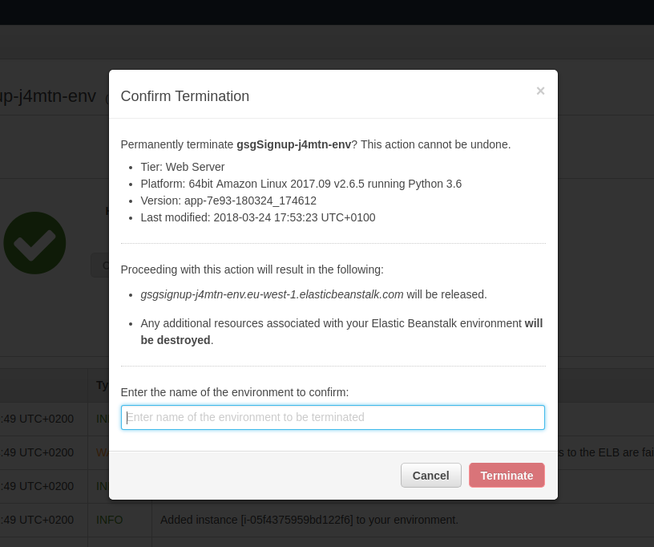
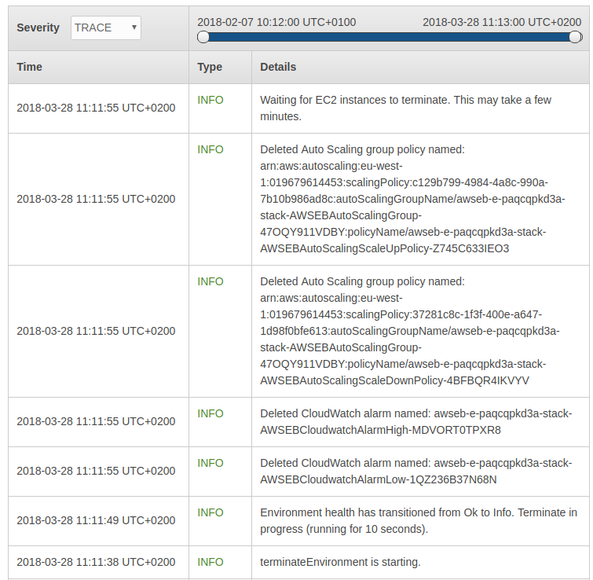

# Lab session #4: Creating a web application using cloud PaaS

Course link: [ccbda-upc.github.io](https://ccbda-upc.github.io/).

Group 1207

-   Quang Duy Tran - duy9968\@gmail.com

-   Marc Garnica Caparros - marcgarnicacaparros\@gmail.com

Assignment link: [Lab 4 Assignment](https://github.com/CCBDA-UPC/Assignments-2018/blob/master/Lab04.md)
Webapp repository: [Django express webapp](https://github.com/marcgarnica13/eb-django-express-singup-base)

## Objectives

The following README summarizes the tasks done during the fourth lab session
of the Cloud Computing for Big Data Analytics course in Universitat Politècnica
de Catalunya. For project delivery and recovery of information during the course evolution.

This session uses AWS Elastic Beanstalk to build a small webapp using Django and DynamoDB. This repository only includes the comments, answers and screenshots of the session but the implementation of the app can be found in the linked [repository](https://github.com/marcgarnica13/eb-django-express-singup-base). During the following sessions this repository will keep track of the modifications and updates of the webapp.

### Pre-lab homeworks

-   As prerequisites for this lab session it was only required to set up correctly AWS CLI and AWS EB CLI as was shown in the [first session of this course](https://github.com/CCBDA-UPC/Cloud-Computing-QuickStart/blob/master/Quick-Start-AWS.md).

### Lab tasks

-  [x] The initial template with a basic Django webapp can be found in this [link](https://github.com/CCBDA-UPC/eb-django-express-signup-base). And it has been downloaded and pushed to the webapp [repository] (https://github.com/marcgarnica13/eb-django-express-singup-base).

-  [x] Create an IAM Policy and Role to enable the webapp access the detailed resources of AWS.
-  [x] **DynamoDB Table** Create the *gsh_signup_table* in the [AWS DynamoDB console](https://console.aws.amazon.com/dynamodb/home).


-  [x] At this point we were able to run the webapp locally. The **boto3** python package is in charge of connecting to the AWS CLI and targetting the *gsg-signup-table* created. In order to run the server properly, first we install **boto3** and **django** python packages and these commands were needed:

  ```
  (eb-virt)~$ python manage.py migrate
  (eb-virt)~$ python manage.py runserver
  ```

  But in order to execute correclty Django needs three OS variables. Those can be introduced by:

  ```
  _$ export DEBUG="True"
  _$ export STARTUP_SIGNUP_TABLE="gsg-signup-table"
  _$ export AWS_REGION="eu-west-1"
  ```

  Or:
  ```
  _$ source extra-files/environment.sh
  ```

  This variables are *terminall session dependent* which means that are only specific to the current bash session (console). By closing the bash session, the variables are lost.

  Finally, this image shows hows the app runs locally and we were able to add some new records to the DynamoDB table.


-  [x] **Deploy the webapp to the AWS Beanstalk environment:** Configure correctly the new EB and deploy the webapp using the AWS EB client. Finally the EB console looked like this:


  The webapp can be accesed throug this [link](http://gsgsignup-j4mtn-env.eu-west-1.elasticbeanstalk.com/) and it is consequently adding new records to the DynamoDB table.


  The configuration was saved for future deployments.

-  [x] **First check:** Terminating the EC2 instance that the AWS uses fot the Elastic Beanstalk environment.What has happened? Why do you think that has happened?

 After terminating the EC2 instance in EC2 console, the AWS console first of all warns us indicating that this instances is being used by an EB environment.this is just to point that this action will imply problems on the Elastic Beanstalk environment.

 

 Looking at the EB console, we can see that the instance is captured as crashed and the environment health went from OK to Severe because there were no instances running.

 

 After a few minutes, it has added a new instance automatically and health went back to OK, the website is up again. This happens because environment type (Auto Scaling) has set the minimum instance to 1, meaning it ensures there's always at least 1 instance running.

 

 

  Loooking back again to the EC2 console we can see that the terminated instance is still there in terminated status but a new one has been added serving the EB console.

  

-  [x] **Second check:** Terminate the environment from the EBS console.What has happened? Why do you think that has happened? Check both EC2 and EB consoles.

 The console shows a confirmation dialog indicating the release of the domain used for the environment the termination of all the additional resources associated, for instance, the EC2 instance.

 

 After confirmig the terminate action, this are the actions that the EB console runs:

 

 As it is shown in the last picture, When environment is starting to terminate, it deletes de CloudWatch configured for the environment, it also removes the auto scaling group policy and then finally terminates the running EC2 instance. The auto scaling policy was removed first in order to prevent it from adding new EC2 instance.

 When the EC2 terminates, the console deletes also the auto scaling and the load balancer to finally remove the environment. 
