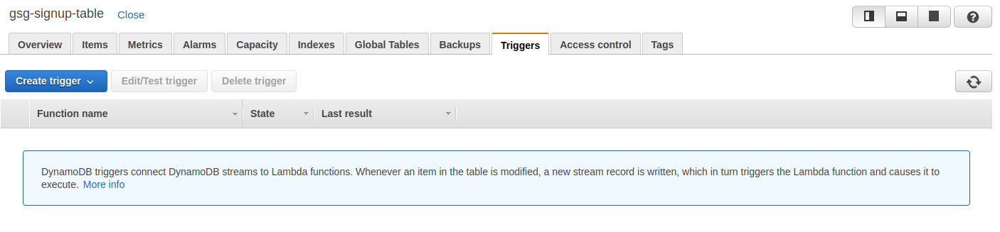
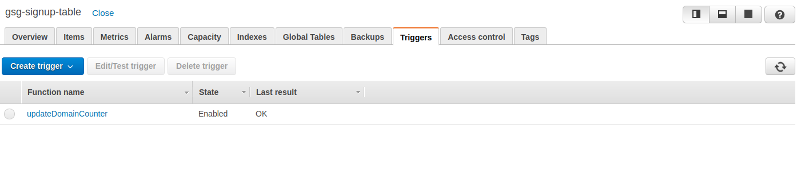
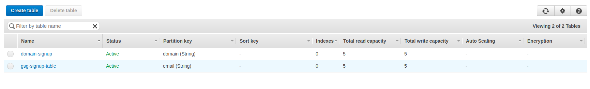
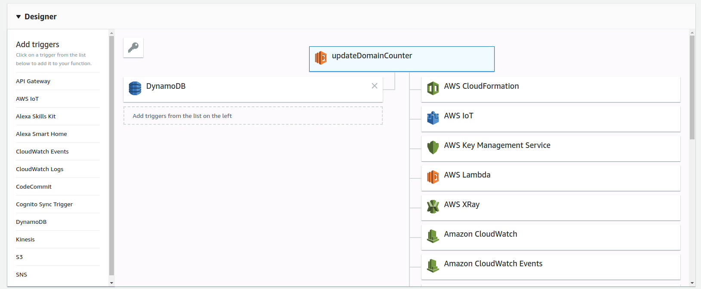
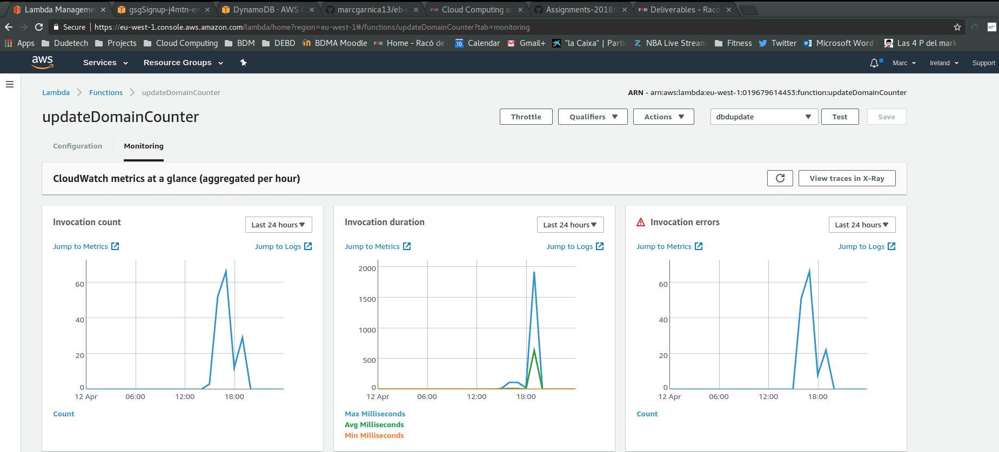
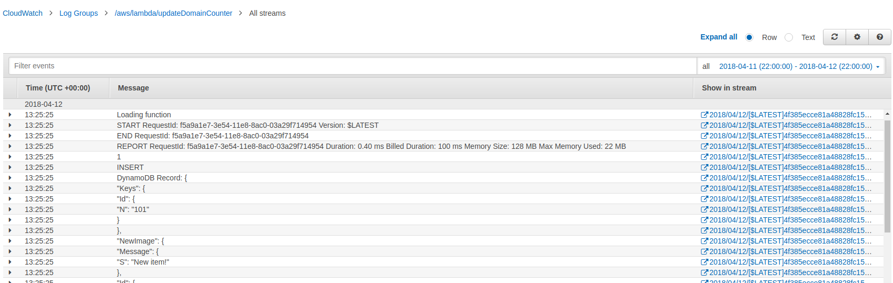

# Improve the web app transfer of information
As mentioned in the lab assignment, to achieve of the functionality of having a drop-down of different menus with the total count of appearances in the database, we need to perform a full scan on the DynamoDB table and then perform a Hash counter in main memory.

Obviously this has clear consequences in the performance of our service if we open the concept of Big Data and large volumes of information transferred and processed for a simple feature.

This is due to the structure of the NoSQL database DynamoDB which allows a very flexible schema-less environment but as a down-side cannot perform query optimizations and aggregations on the fly.

To optimize this we required of some strategy to keep the counting of the domains added to the signup database through other interfaces. The basic structure is the following.

## New services of AWS

- The **signup** table has been configured to broadcast with a trigger to create streams at every event occured. In other words, at every insert, update or delete the AWS service is creating a stream with the performed action.



  A new trigger has been created with the default configurations.



- A new DynamoDB table has been added called domain-signup. This table as only two attributes [domain, d_counter] containing the materialized aggregation for the query our service requires.



- The streams generated by the trigger are gathered by a [AWS Lambda function](https://eu-west-1.console.aws.amazon.com/lambda). The process of this Lambda function is the following:
   - Getting the stream or streams.
   - For every event in the stream:
     - Get the domain of the new item in the table.
     - Update the domain-signup table with a new row for the domain or increment the counter of the existing domain.

  The code of the Lambda function is the following:

```python
  import json
  import boto3

  print('Loading function')

  def update_domain_count(domain, newCount):
      dynamodb = boto3.resource("dynamodb", region_name='eu-west-1')
      table = dynamodb.Table('domain-signup')

      try:
          response = table.update_item(
              Key= {
                  'domain': domain
              },
              UpdateExpression="set d_counter = :c",
              ExpressionAttributeValues= {
                  ':c': newCount
              }
          )

      except Exception as e:
          print(e.response['Error']['Message'])
          return None

      status = response['ResponseMetadata']['HTTPStatusCode']
      if status == 200:
          if 'Attributes' in response:
              logger.error('Existing item updated to database.')
              return 409
          print('New item added to database.')
      else:
          print('Unknown error inserting item to database.')

      return status


  def get_domain_count(domain):
      dynamodb = boto3.resource("dynamodb", region_name='eu-west-1')
      table = dynamodb.Table('domain-signup')

      try:
          response = table.get_item(
              Key= {
                  'domain': domain
              }
          )

      except ClientError as e:
          print(e.response['Error']['Message'])
          return None
      else:
          item = response['Item']
          print("GetItem succeeded:")
          print(item['d_counter'])
          return(item['d_counter'])


  def lambda_handler(event, context):
      print("Received event: " + json.dumps(event, indent=2))
      for record in event['Records']:
          print('New signup in dynamod db')
          #print(record['dynamodb']['Keys']['email']['S'].split('@')[1])
          domain = 'testmail.com'
          update_domain_count(domain, get_domain_count(domain) + 1)

      return 'Successfully processed {} records.'.format(len(event['Records']))
```

As we can see in the following picture, Lambda function are so useful to configure server-less functions and connect different elements of our architecture.



AWS Lambda functions provides a powerful monitoring interface to analyse how and in which frequency your functions are being executed. Moreover, you can access the logs through the [AWS CloudWatch](https://eu-west-1.console.aws.amazon.com/cloudwatch) and see the events cached by the Lambda function and also the output of them.






## Changes in the Client app

One of the main objectives of this development was to **keep the client app as independ as possible of the configuration behind** but for obvious reason this optimization requires minor changes in the way the client django app is reading the domains and count of the system. For that reason two minor changes have been added to the files *views.py* and *models.py*

 - The *models.py* was scanning the full signup table and sending to the view all the domain list. Consequently with the new backend nodes added, the client only needs to connect to the domain_signup table and retriev all the records (way less data than before).

 ```python
 def get_leads(self, domain, preview):
    try:
        dynamodb = boto3.resource('dynamodb', region_name=AWS_REGION)
        table = dynamodb.Table('gsg-signup-table')
        domaintable = dynamodb.Table('domain-signup')
    except Exception as e:
        logger.error(
            'Error connecting to database table: ' + (e.fmt if hasattr(e, 'fmt') else '') + ','.join(e.args))
        return None
    # success in connecting to the database
    expression_attribute_values = {}
    FilterExpression = []
    if preview:
        expression_attribute_values[':p'] = preview
        FilterExpression.append('preview = :p')
    if domain:
        expression_attribute_values[':d'] = '@' + domain
        FilterExpression.append('contains(email, :d)')
    if expression_attribute_values and FilterExpression:
        response = table.scan(
            FilterExpression=' and '.join(FilterExpression),
            ExpressionAttributeValues=expression_attribute_values,
        )
    else:
        response = domaintable.scan(
            ReturnConsumedCapacity='TOTAL',
        )
    if response['ResponseMetadata']['HTTPStatusCode'] == 200:
        print(response)
        return response['Items']
    logger.error('Unknown error retrieving items from database.')
    return None
 ```

  - Moreover, now the *vies.py* script does not need to perform a count on all the items of the signup, it only needs to iterate over the domains and store the count indicated in the d_counter attribute.

  ```python
  def search(request):
    # value is the part right after the @ of the email address
    domain = request.GET.get('domain')
    # values are Yes/No for the leads interested or not in the preview
    preview = request.GET.get('preview')
    leads = Leads()
    #retrieving the value of the paraemeters
    items = leads.get_leads(domain, preview)
    #if the parameters are set, we render the records matching the search
    if domain or preview:
        return render(request, 'search.html', {'items': items})
    #if both are empty, we count the number how many addresses per domain
    else:
        domain_count = Counter()
        for item in items:
            domain_count[item['domain']] = item['d_counter']

        return render(request, 'search.html', {'domains': sorted(domain_count.items())})
  ```

## Benefits and thresholds accepted during the optimizations

This optimization in the architecture of our deployment is reducing the amount of data transferred through the network and reducing with the same factor the computational cost of counting the domain retrieved from the signup table. On the other hand, the configuration has become more complex in terms of number of elements playing and number of interactions, plus adding the fact that now the computational cost has increased when inserting new leads. On every insert, the system will also propagat a stream and execute the lambda fucntion, which has a cost in time and in money (Billing in AWS).

Afther development this task two main conclusions have been extracted:

-  [x] It is crucial for an architecutre design to keep in mind the amoun of data and the granularity in order to define the most efficient schema for the desired operations. Volume of data and predefined queries in our database are key points to consider during the software architecture design. There's no an always-optimal solution, each implementation has its own requirements.

-  [x] AWS Lambda functions are providing to the developer a way of connecting nodes of their deployment without really adding dependencies and links on the main code. From now on, only that snipped of code developed have to be changed in order to change the aggregation on domain. Even more, other Lambda functions can be pipelined or attached to the chain to increase our features without modifying the core of our application.
