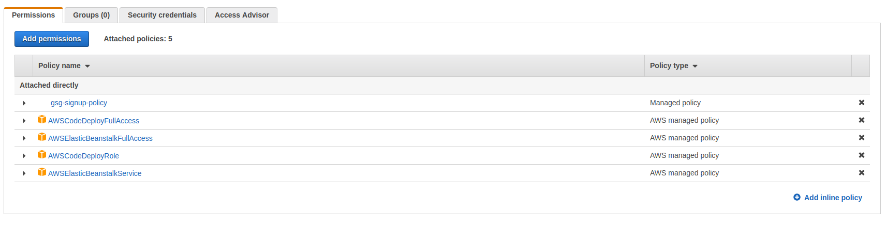
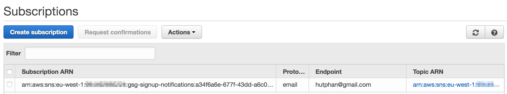
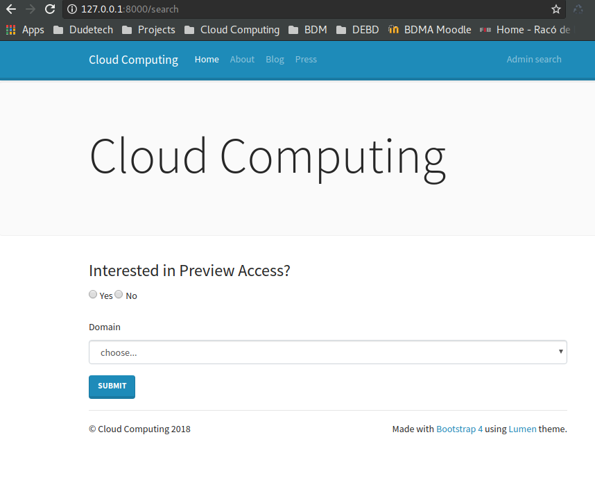

Cloud Computing, class of 2018
------------------------------

### Universitat Politècnica de Catalunya

Course link: [ccbda-upc.github.io](https://ccbda-upc.github.io/).

Group 1207

-   Quang Duy Tran - duy9968\@gmail.com

-   Marc Garnica Caparros - marcgarnicacaparros\@gmail.com

Assignment link: [Lab 5 Assignment](https://github.com/CCBDA-UPC/Assignments-2018/blob/master/Lab05.md)
Webapp repository: [Django express webapp](https://github.com/marcgarnica13/eb-django-express-singup-base)

## Objectives

The following README summarizes the tasks done during the fifth lab session of the Cloud Computing for Big Data Analytics course in Universitat Politècnica de Catalunya. For project delivery and recovery of information during the course evolution.

This session uses Simple Notification Service and CloudFront to enrich the services by adding more functions to the web. This repository only includes the comments, answers and screenshots of the session but the implementation of the app can be found in the linked [repository](https://github.com/marcgarnica13/eb-django-express-singup-base). During the following sessions this repository will keep track of the modifications and updates of the webapp.

## Pre-lab homeworks

The pre-lab homework requires to create a new IAM user and grant only sufficient permissions for deployment, initially only programmatic access and `gsg-signup-policy`. However, it was not enough to deploy on ElasticBeanstalk. The following policies were added: 
-   AWSElasticBeanstalkFullAccess - AWS Managed policy
-   AWSElasticBeanstalkService - AWS Managed policy
-   AWSCodeDeployRole - AWS Managed policy
-   AWSCodeDeployFullAccess - AWS Managed policy

## Lab tasks

### Task 5.1: Use Amazon Simple Notification Service in your web app
-  [x] Create an SNS topic: SNS allows notifications to be sent every time new data is successfully inserted to DynamoDB. Firstly the SNS topic was created, then a subscription to tell how and where the notification is sent.

The subscription ID had to be added as environment parameter for the local app, also in Elastic Beanstalk for further deployment.

-  [x] Modify the web app to send messages

New functions were added to _form/models.py_ and _form/views.py_ to send the notification with SNS. At first, due to lack of permissions, the newly created IAM user could not publish on SNS. To solve this, extra policy was added (`sns:Publish`). Now the SNS is correctly functioning, sending an email when there is a new signup.

### Task 5.2: Create a new option to retrieve the list of leads

To create a new view, first we need to add a new URL in _form/urls.py_ and then write the controller in _forms/view.py_
The new search view allows us to look for item in the DynamoDB, with Preview Access and email's domain name as parameters. To get these records, method `get_leads` is added to _forms/model.py_. The HTML file is in _form/templates/search.html_
After saving all the changes, we have the working search page in the local web app 

