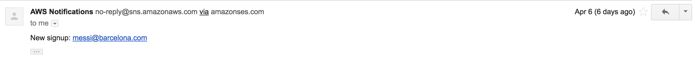
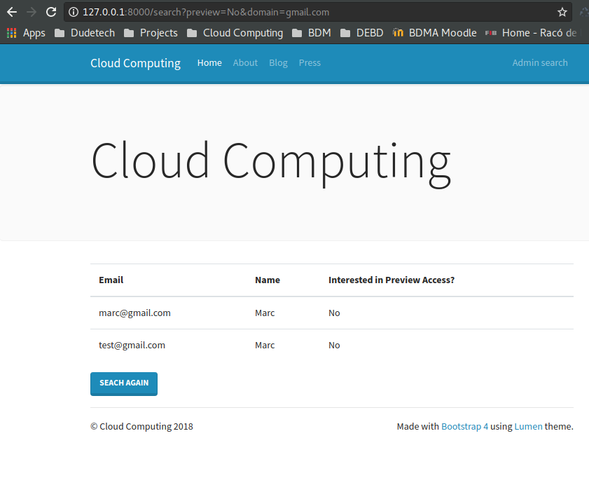
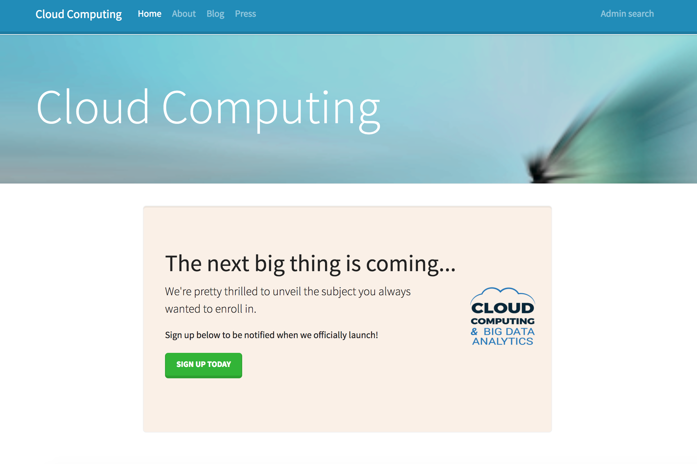
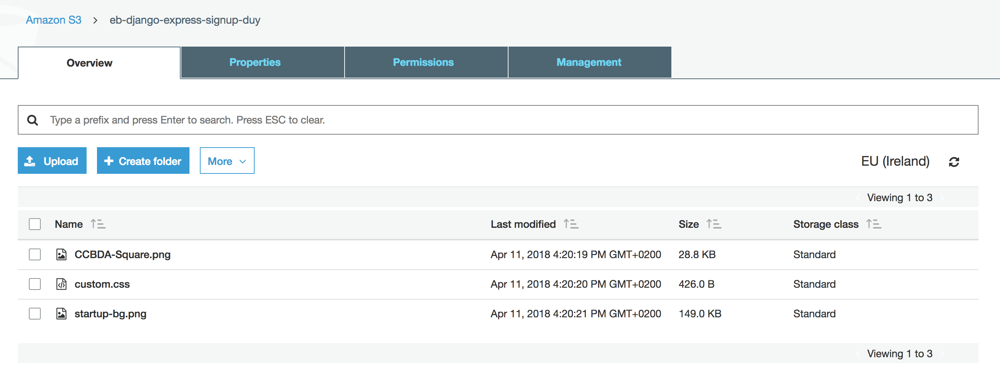
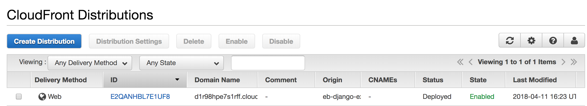
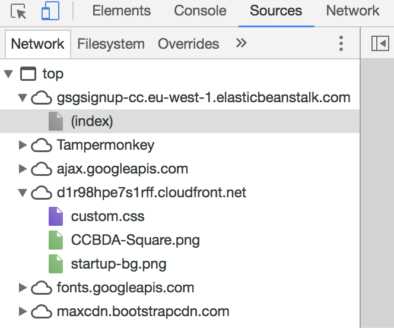

Cloud Computing, class of 2018
------------------------------

### Universitat Politècnica de Catalunya

Course link: [ccbda-upc.github.io](https://ccbda-upc.github.io/).

Group 1207

-   Quang Duy Tran - duy9968\@gmail.com

-   Marc Garnica Caparros - marcgarnicacaparros\@gmail.com

Assignment link: [Lab 5 Assignment](https://github.com/CCBDA-UPC/Assignments-2018/blob/master/Lab05.md)
Webapp repository: [Django express webapp](https://github.com/marcgarnica13/eb-django-express-singup-base)

## Objectives

The following README summarizes the tasks done during the fifth lab session of the Cloud Computing for Big Data Analytics course in Universitat Politècnica de Catalunya. For project delivery and recovery of information during the course evolution.

This session uses Simple Notification Service and CloudFront to enrich the services by adding more functions to the web. This repository only includes the comments, answers and screenshots of the session but the implementation of the app can be found in the linked [repository](https://github.com/marcgarnica13/eb-django-express-singup-base). During the following sessions this repository will keep track of the modifications and updates of the webapp.

## Pre-lab homeworks

The pre-lab homework requires to create a new IAM user and grant only sufficient permissions for deployment, initially only programmatic access and `gsg-signup-policy`. However, it was not enough to deploy on ElasticBeanstalk. The following policies were added:
-   AWSElasticBeanstalkFullAccess - AWS Managed policy
-   AWSElasticBeanstalkService - AWS Managed policy
-   AWSCodeDeployRole - AWS Managed policy
-   AWSCodeDeployFullAccess - AWS Managed policy

## Lab tasks

### Task 5.1: Use Amazon Simple Notification Service in your web app
-  [x] Create an SNS topic: SNS allows notifications to be sent every time new data is successfully inserted to DynamoDB. Firstly the SNS topic was created, then a subscription to tell how and where the notification is sent.

The subscription ID had to be added as environment parameter for the local app, also in Elastic Beanstalk for further deployment.

-  [x] Modify the web app to send messages

New functions were added to _form/models.py_ and _form/views.py_ to send the notification with SNS. At first, due to lack of permissions, the newly created IAM user could not publish on SNS. To solve this, extra policy was added (`sns:Publish`). Now the SNS is correctly functioning, sending an email when there is a new signup.

### Task 5.2: Create a new option to retrieve the list of leads

To create a new view, first we need to add a new URL in _form/urls.py_ and then write the controller in _forms/view.py_
The new search view allows us to look for item in the DynamoDB, with Preview Access and email's domain name as parameters. To get these records, method `get_leads` is added to _forms/model.py_. The HTML file is in _form/templates/search.html_
After saving all the changes, we have the working search page in the local web app

### Task 5.3: Improve the web app transfer of information (optional)
The full documentation on this task has been added in [Optimizaton.md](./Optimization.md) for readability of the assignment and to include all the necessary explanations for the task.

### Task 5.4: Deliver static content using a Content Delivery Network

-  [x] The static content in our web app

In this task, we use CSS to add custom style to the web. At first, it was imported locally in directory _static_.

-  [x] Upload static content to Amazon S3 and grant object permissions

In order to reduce server load and latency while browsing the web app, we move static files to CDN, with amazon S3.

A new bucket was created with all the static files used in the previous part. Public read permission were granted so that other services can use these resources.

-  [x] Create a CloudFront CDN Web Distribution

Contents from Amazon S3 are delivered with CloudFront. They can be accessed through [CloudFront URL](http://d1r98hpe7s1rff.cloudfront.net/custom.css)

-  [x] Change the code and test links

In this part, we have used Django support for CDN, thus CSS file linking is still written by ` <link href="" rel="stylesheet">`, however the static directory is now referenced to our newly created CDN in the previous part.
The [web app](http://gsgsignup-cc.eu-west-1.elasticbeanstalk.com/) is deployed and function well.

#### Q55: How long have you been working on this session (including the optional part)? What have been the main difficulties you have faced and how have you solved them?
### Difficulties faced during this session

This session it has been equivalent to approximately 10 hours of work. The main difficulties faced where revealed thanks to the other class group on Tuesday. The reported the majority of the issues and helped our class group to go straight to the point in the session.

Nevertheless, some of the links to Tutorials added in this session are using an outdated interface of AWS and some of the default configuration for setting up CDN and S3 required some research.

All in all, the optional part was also time consuming due to the fact that there was nothing added previously on how to perform efficient aggregation on DynamoDB. We faced two main options:
 1- Changes the main code and every time a new lead is added through the django app, also update the aggregations manually.
 2- Use extra services to have the same effect without changing the core code.

Option number 1 was definitely the most doable and fast but we decided to try with the components of AWS for better learning. Even though we added difficulty we think this can be very helpful for our project in the following months.
