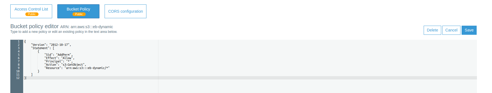

# Lab session #6: Interacting with users and services in the Cloud

### Universitat Politècnica de Catalunya

Course link: [ccbda-upc.github.io](https://ccbda-upc.github.io/).

Group 1207

-   Quang Duy Tran - duy9968\@gmail.com

-   Marc Garnica Caparros - marcgarnicacaparros\@gmail.com

Assignment link: [Lab 6 Assignment](https://github.com/CCBDA-UPC/Assignments-2018/blob/master/Lab06.md)
Webapp repository: [Django express webapp](https://github.com/marcgarnica13/eb-django-express-singup-base)

## Objectives

The following README summarizes the tasks done during the sixth lab session of the Cloud Computing for Big Data Analytics course in Universitat Politècnica de Catalunya. For project delivery and recovery of information during the course evolution.

This session continues the deployment of a basic web app with Django framework accessible in this [repository](https://github.com/marcgarnica13/eb-django-express-singup-base). During the following sessions this repository will keep track of the modifications and updates of the webapp.

This session works on how to provide oour services with a REST API and use third party services to enrich our features. Finally it connects the app with Google Cloud Platform for advanced analytics.

## Pre-lab homeworks

No pre-lab tasks needed

## Lab tasks

### Task 6.1: How to provide your services through a REST API

On our product development is always wise to decouple as much as possible our architecture and one great strategy for achieving independence between our components is to separate the creation of results with the visualization of them.

In this section we want to provide a web-based API providing the needed results to the interface for plotting a chart. On top of gaining flexibility this also makes the results reusable for other purposes (p.e other pages of other web app where the data is needed as well)

- [x] We added a new mapped URL to our application */chart*.
- [x] For plotting the chart we used the Python library [Vincent](https://github.com/wrobstory/vincent) connecting with the front-end javascript library [D3.js](https://d3js.org/).
- [x] The initial code for plotting the chart was the following:

```python
import vincent
from django.conf import settings

BASE_DIR = getattr(settings, "BASE_DIR", None)


def chart(request):
    domain = request.GET.get('domain')
    preview = request.GET.get('preview')
    leads = Leads()
    items = leads.get_leads(domain, preview)
    domain_count = Counter()
    domain_count.update([item['email'].split('@')[1] for item in items])
    domain_freq = domain_count.most_common(15)
    if len(domain_freq) == 0:
        return HttpResponse('No items to show', status=200)
    labels, freq = zip(*domain_freq)
    data = {'data': freq, 'x': labels}
    bar = vincent.Bar(data, iter_idx='x')
    bar.to_json(os.path.join(BASE_DIR, 'static', 'domain_freq.json'))
    return render(request, 'chart.html', {'items': items})
```

And consequently our interface *chart.html* was as follows:

```html

<!DOCTYPE html>
<html>
<head>
    <title>Vega Scaffold</title>
    <script src="http://d3js.org/d3.v3.min.js" charset="utf-8"></script>
    <script src="http://d3js.org/topojson.v1.min.js"></script>
    <script src="http://d3js.org/d3.geo.projection.v0.min.js" charset="utf-8"></script>
    <script src="http://trifacta.github.com/vega/vega.js"></script>
</head>
<body>
<div id="vis"></div>
</body>
<script type="text/javascript">
    // parse a spec and create a visualization view
    function parse(spec) {
        vg.parse.spec(spec, function (chart) {
            chart({el: "#vis"}).update();
        });
    }
    parse('');
</script>
</html>
```
- [x] Following the setup configuration the data gathered was dumped to a the *domain_freq.json* inside the *static* folder. As seen in previous sessions, this static folder is linked to an AWS S3 bucket and served as static content by AWS CloudFront. In other words, the data of this file it is not updated eventhough changing the query which causes errors in the content of the chart.

  This is our solution on how to solve this problem:

   - We created a new S3 bucket responsible of serving to the web app the dynamic content. Called eb-dynamic.

   

   - On each request served by the application, the data is stored in a file and updated in the eb-dynamic s3 bucket. The following code was modified.

   On *views.py*

   ```python
   def chart(request):
    domain = request.GET.get('domain')
    preview = request.GET.get('preview')
    # if both domain and preview are provided the file name is the concatenation of both
    if domain and preview:
        requestFileName = str(domain) + str(preview) + '.json'
    # if only the domain is provided the file name is the domain
    elif domain:
        requestFileName = str(domain) + '.json'
    # if only the preview is provided the file name is the preview
    elif preview:
            requestFileName = str(preview) + '.json'
    # finally if nothing is provided the file name is all.json
    else:
        requestFileName = 'all.json'

    leads = Leads()
    items = leads.get_leads(domain, preview)
    domain_count = Counter()
    domain_count.update([item['email'].split('@')[1] for item in items])
    domain_freq = domain_count.most_common(15)

    if len(domain_freq) == 0:
        return HttpResponse('No items to show', status=200)

    labels, freq = zip(*domain_freq)
    # data for the chart
    data = {'data': freq, 'x': labels}
    bar = vincent.Bar(data, iter_idx='x')

    # updating/creating the file in the S3 dynamic bucket
    leads.push_chart_definition(bar.to_json(), requestFileName)

    # building the URL for accessing the file
    requestFileName = 'https://s3-eu-west-1.amazonaws.com/eb-dynamic/' + str(requestFileName)
    return render(request, 'chart.html', {'requestFileName': requestFileName})
   ```

   And on the file *models.py*

    ```python
    def push_chart_definition(self, chart, name):
        try:
            s3 = boto3.resource('s3', region_name=AWS_REGION)
            obj = s3.Object('eb-dynamic', name)
            obj.put(Body=chart)
        except Exception as e:
            logger.error(
                'Error connecting to the s3 bucket: ' + (e.fmt if hasattr(e, 'fmt') else '') + ','.join(e.args)
            )
            return None

    ```

    Notice that in order to provide a correct answer in any request we are not just using one file in the S3 bucket. This are the possible combinations for creating a file depending on the query:

    | Domain | Preview | Filename |
    | :---: | :---: | :---: |
    | catalunya.cat | Yes  | catalunya.cat.Yes.json |
    | -  | No  | No.json |
    | gmail.com | - | gmail.com.json |
    | - | - | all.json |

    Aligned with that the *chart.html* file is now using the sent variable requestFileName to GET the file to parse for the chart plot:

    ```html
    
    <!DOCTYPE html>
    <html>
    <head>
        <title>Vega Scaffold</title>
        <script src="http://d3js.org/d3.v3.min.js" charset="utf-8"></script>
        <script src="http://d3js.org/topojson.v1.min.js"></script>
        <script src="http://d3js.org/d3.geo.projection.v0.min.js" charset="utf-8"></script>
        <script src="http://trifacta.github.com/vega/vega.js"></script>
    </head>
    <body>
    <div id="vis"></div>
    </body>
    <script type="text/javascript">
        // parse a spec and create a visualization view
        function parse(spec) {
            vg.parse.spec(spec, function (chart) {
                chart({el: "#vis"}).update();
            });
        }
        parse('{{ requestFileName }}')
    </script>
    </html>
    ```

    When running in localhost, we experienced some problems receivng a *403 Forbidden* code when GETTING the desired file from our S3 bucket. At first, we tried to solve to the CORS configurations but what really solved the problem was adding a policy to the bucket. Both policy and CORS can be seen in the following images.

    

    

    After this the application was running correctly in local.

 - [x] When deploying we needed to run again the ```pip freeze > requirements.txt``` in order to ensure the Elasticbeanstalk environment install all the packaged needed for the app. Finally the chart feature was working well in the EB. The application can be accessed through this [link](http://gsgsignup-j4mtn-env.eu-west-1.elasticbeanstalk.com)

  

  

  - [x] After running a few queries on the browser the S3 bucket looked like this:

  

    The bucket works as a REST API serving json files as resources. Knowing the file name, all the resourcesare publicly accessible in following this link [https://s3-eu-west-1.amazonaws.com/eb-dynamic/](https://s3-eu-west-1.amazonaws.com/eb-dynamic/)


### Task 6.2: How to provide our service combined with third-party services

In this exercise, we will gather all the tweets showing location within a geological boundary and plot them on the map using GeoJson and Leaflet.js.

- [x] Firstly, we open a listener for getting tweets and put it in a NoSQL database on DynamoDB, named `twitter-geo`. The tweets are filtered by geo bounding box.
```python
    twitter_stream = Stream(auth, MyListener())
    twitter_stream.filter(locations=[-129.4,8.3,121.3,52.3])
```

- [x] After having the data, we plot them on our Django web app, a new url _map_ is added. In _form/models.py_ we add a new model with function _get_tweets_:

```python
    class Tweets(models.Model):
        def get_tweets(self, from_time, to_time):
            try:
                dynamodb = boto3.resource('dynamodb', region_name=AWS_REGION)
                table = dynamodb.Table('twitter-geo')
            except Exception as e:
                logger.error(
                    'Error connecting to database table: ' + (e.fmt if hasattr(e, 'fmt') else '') + ','.join(e.args))
                return None
            response = table.scan()
            if response['ResponseMetadata']['HTTPStatusCode'] == 200:
                return response['Items']
            logger.error('Unknown error retrieving tweets from database.')
            return None
```

- [x] In _form/views.py_, the following code is added. It get the request from the browser, request tweets from the model and put in file _geo_data.json_
```python
import json
def map(request):
    geo_data = {
        "type": "FeatureCollection",
        "features": []
    }
    tweets = Tweets()
    for tweet in tweets.get_tweets():
        geo_json_feature = {
            "type": "Feature",
            "geometry": {
                "type": "Point",
                "coordinates": [tweet['c0'], tweet['c1']]
            },
            "properties": {
                "text": tweet['text'],
                "created_at": tweet['created_at']
            }
        }
        geo_data['features'].append(geo_json_feature)
    with open(os.path.join(BASE_DIR, 'static', 'geo_data.json'), 'w') as fout:
        fout.write(json.dumps(geo_data, indent=4))
    return render(request, 'map.html')
```

- [x] Finally, the HTML file _forms/templates/map.html_ is created, getting Json data from the static folder.

- [x] To enhance the app, we implement the map such that the user can restrict the tweets with parameters _from_ and _to_ indicating the time range that the tweet was posted. In order to do so, everytime an user input a time range, the app will scan and filter the Dynamo DB, put the needed data to a new Json file with the format from-_fromtime_-to-_totime_.json and upload to Amazon S3 then the view will get from there.

The view is modified as below: 

```python
def map(request):
    from_time = request.GET.get('from')
    to_time = request.GET.get('to')
    time_format = '^\d{4}(-(0[1-9]|1[012])(-([012][0-9]|3[01])(-([01][0-9]|2[0-3])(-[0-5][0-9]){0,2})?)?)?$'
    if from_time:
        try:
            re.match(time_format,from_time).group(0)
        except Exception as e:
            return HttpResponse('Invalid time format, the format is YYYY-MM-DD-HH-MM-SS', status=200)
    if to_time:
        try:
            re.match(time_format,to_time).group(0)
        except Exception as e:
            return HttpResponse('Invalid time format, the format is YYYY-MM-DD-HH-MM-SS', status=200)
    if from_time and to_time:
        if (to_time < from_time):
            return HttpResponse('Invalid time range', status=200)
        geoFileName = 'from-' + from_time + '-to-' + to_time + '.json'
    elif from_time:
        geoFileName = 'from-' + from_time + '.json'
    elif to_time:
        geoFileName = 'to-' + to_time + '.json'
    else:
        geoFileName = 'geo_data.json'
    geo_data = {
        "type": "FeatureCollection",
        "features": []
    }
    tweets = Tweets()
    for tweet in tweets.get_tweets(from_time,to_time):
        geo_json_feature = {
            "type": "Feature",
            "geometry": {
                "type": "Point",
                "coordinates": [tweet['c0'], tweet['c1']]
            },
            "properties": {
                "text": tweet['text'],
                "created_at": tweet['created_at']
            }
        }
        geo_data['features'].append(geo_json_feature)
    tweets.push_tweets(json.dumps(geo_data, indent=4),geoFileName)

    geoFileName = 'https://s3-eu-west-1.amazonaws.com/eb-dynamic/' + str(geoFileName) 
    return render(request, 'map.html', {'geoFileName': geoFileName})
```

As can be seen from the code, the view gets two parameters, _from_ and _to_. It will check if the input matches our time format YYYY-MM-DD-HH-MM-SS by regular expression. We can put only YYYY, YYYY-MM or YYYY-MM-DD and so on. Furthermore, it will check if the time range is correct (_from_time_ is less than or equal _to_time_).
The parameters are used for getting the tweets from Dynamo DB, using _get_tweets_ function from the _Tweets_ model. 

```python
def get_tweets(self, from_time, to_time):
    ...
    expression_attribute_values = {}
    FilterExpression = []
    if from_time:
        expression_attribute_values[':from_time'] = from_time
        FilterExpression.append('created_at >= :from_time')
    if to_time:
        expression_attribute_values[':to_time'] = to_time
        FilterExpression.append('created_at <= :to_time')
    if expression_attribute_values and FilterExpression:
        response = table.scan(
            FilterExpression=' and '.join(FilterExpression),
            ExpressionAttributeValues=expression_attribute_values,
        )
    else:
        response = table.scan()
    ...
```

The function allows either only _from_ or _to_ parameters or both of them. If no parameter is specified, it will get all the record. Initially, tweets' date format cannot be compared by string (e.g Thu Dec 3 18:26:07 +0000 2010), we need to modify _TwitterListener.py_ to change the format and put to Dynamo DB:
```python
import time
response = self.table.put_item(
    Item={
        'id': tweet['id_str'],
        'c0': str(tweet['coordinates']['coordinates'][0]),
        'c1': str(tweet['coordinates']['coordinates'][1]),
        'text': tweet['text'],
        'created_at': time.strftime('%Y-%m-%d-%H-%M-%S', time.strptime(tweet['created_at'],'%a %b %d %H:%M:%S +0000 %Y')),
        }
)
```
The new time format `YYYY-MM-DD-HH-MM-SS` can be compared directly by string.
After getting the data in json, it will be uploaded to S3, using _push_tweets_ function from the model.

```python
    def push_tweets(self, tweets, name):
        try:
            s3 = boto3.resource('s3', region_name=AWS_REGION)
            obj = s3.Object('eb-dynamic', name)
            obj.put(Body=tweets)
        except Exception as e:
            logger.error(
                'Error connecting to the s3 bucket: ' + (e.fmt if hasattr(e, 'fmt') else '') + ','.join(e.args)
            )
        return None
```
After all the changes, we have the web app working with new parameters:


<p align="center">Map with all data (no parameter)</p>


<p align="center">Map with only _from_ parameter</p>


<p align="center">Map with only _to_ parameter</p>


<p align="center">Map with both parameters</p>

We tried to put some invalid parameter value, the map will not be rendered and the follow message is displayed
<p align="center"></p>

Also for invalid time range:
<p align="center"></p>

After some queries, the S3 bucket has newly created json files:
<p align="center"></p>

The previous added policies and CORS configurations allow the app to work on ElasticBeanstalk without problem. It can be accessed from [this URL](http://gsgsignup-cc.eu-west-1.elasticbeanstalk.com/map) 
