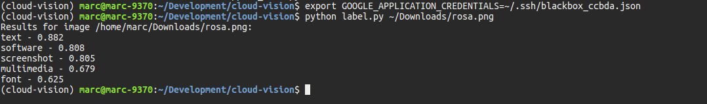
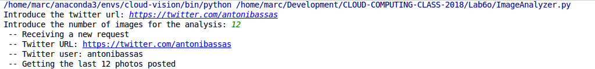
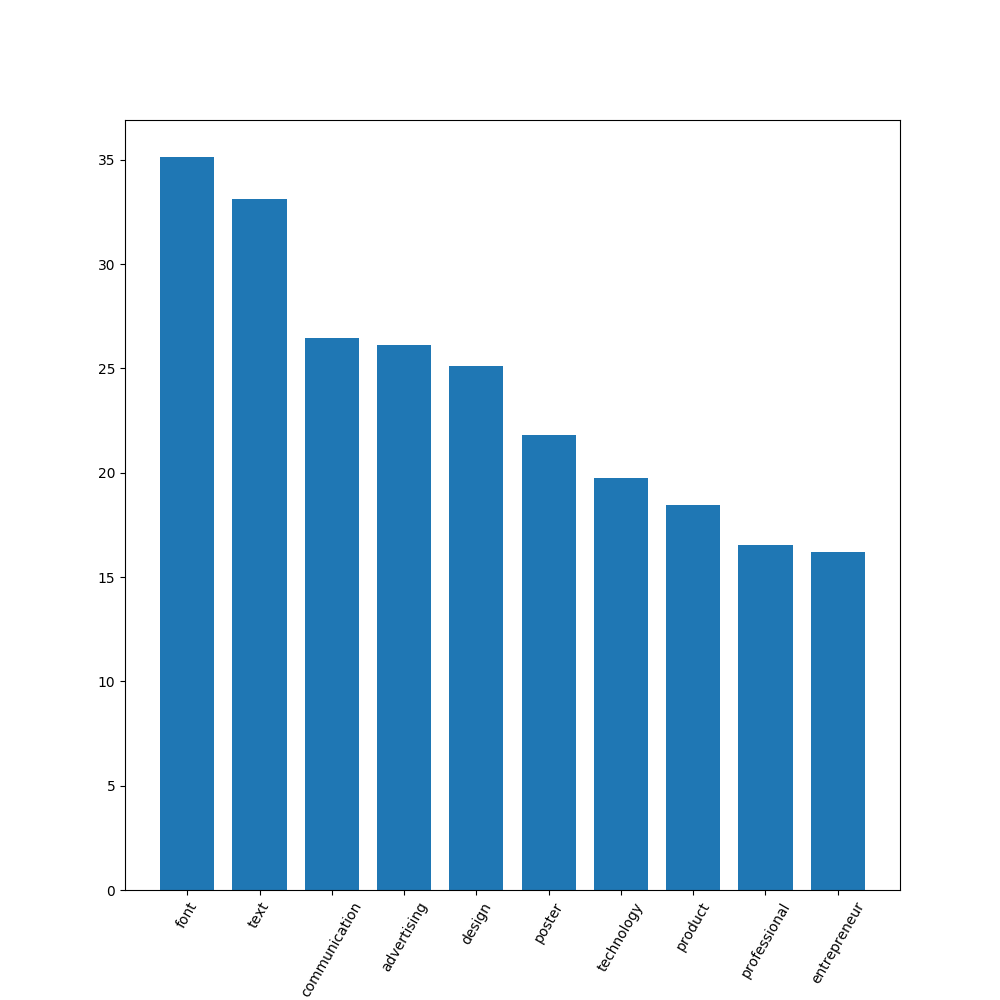

# Lab session #6: Interacting with users and services in the Cloud

### Universitat Politècnica de Catalunya

Course link: [ccbda-upc.github.io](https://ccbda-upc.github.io/).

Group 1207

-   Quang Duy Tran - duy9968\@gmail.com

-   Marc Garnica Caparros - marcgarnicacaparros\@gmail.com

Assignment link: [Lab 6 Assignment](https://github.com/CCBDA-UPC/Assignments-2018/blob/master/Lab06.md)
Webapp repository: [Django express webapp](https://github.com/marcgarnica13/eb-django-express-singup-base)

## Objectives

This lab is the followup on the lab 6 session.

### Task 6.3: Advanced Analytics as a Service in the Cloud

In this last part of the session we have experimented the usage of [Cloud Vision API](https://cloud.google.com/vision/) from Google and python scripts.

- [x] Google Cloud Vision API warmup through the browser. Creating a new project and setting up the resources to execute the demo. After all, setting up some credentials for authentication from external parties (python scripts for instance). Downloading the **credentials files** to a local folder.



- [x] Python environment set up using the [cloud-vision repository](https://github.com/CCBDA-UPC/google-cloud-vision-example).

- [x] Use the knowledge gained to implement a **Image classifier** from twitter feeds. Documented in next section.

#### Classify Images

The file included in this repository [ImageAnalyzer.py](ImageAnalyzer.py) has been developed following the requirements of the assignment and enriching the functionalities as follows.

- [x] Interactive interface with the user to have as flexible as possible script to analyze twitter feeds. The script does not require any command line parameter but when starting it asks for the twitter feed to analyze and the number of photos to retrieve:



- [x] After that the script is connecting with the Twitter API to retrieve the user timeline photos. Each tweet on the user feed is returned as a status object, first of all the scipt is checking whether the tweet contains a photo media or not, if so, it gets the URL of the photo.

- [x] The retrieved photos are then transferred to Google Cloud Vision API as learned through the cloud-vision repository. The results for each images are stored in a python Counter object with the addition of the scores.

  The full functionality until now can be seen in he following code:

  ```python
  def main(twitter_profile, numberOfImages):
      print(' -- Receiving a new request')
      print(' -- Twitter URL: ' + twitter_profile)
      # The only parameter is the twitter profile url
      profile_name = twitter_profile.rsplit('/', 1)[1]
      print(' -- Twitter user: ' + profile_name)
      print(' -- Getting the last ' + str(numberOfImages) + ' photos posted')

      image_count = 0
      tweet_count = 0

      t_images = []

      while (image_count < numberOfImages):
          tweets = api.user_timeline(profile_name, count=100)
          for t in tweets:
              if (image_count < numberOfImages):
                  tweet_count += 1
                  try:
                      for m in t.entities['media']:
                          if m['type'] == 'photo':
                              t_images.append(m['media_url_https'])
                              image_count += 1
                  except:
                      pass

      print(' -- ' + str(image_count) + ' pictures were contained in his/her/its last ' + str(tweet_count) + ' tweets')

      print(' -- Analysing the pictures with Google Cloud Vision API')
      image_count = 0
      service = googleapiclient.discovery.build('vision', 'v1')
      count_label = Counter()
      for url in t_images:
          image_count += 1
          service_request = service.images().annotate(body={
              'requests': [{
                  'image': {
                      'source': {
                          "imageUri": url
                      }
                  },
                  'features': [{
                      'type': 'LABEL_DETECTION',
                      'maxResults': 10
                  }]
              }]
          })

          # [END construct_request]
          # [START parse_response]
          response = service_request.execute()
          print("Results for image " + url + " " + str(image_count) + " out of " + str(numberOfImages))
          for result in response['responses'][0]['labelAnnotations']:
              #print("%s - %.3f" % (result['description'], result['score']))
              count_label[result['description']] += result['score']
          # [END parse_response]

      generate_histogram(count_label, profile_name)
      generate_wordcloud(count_label, profile_name)

  twitter_url = str(input("Introduce the twitter url: "))
  numberOfImages = int(input("Introduce the number of images for the analysis: "))
  main(twitter_url, numberOfImages)
  ```

- [x] Probably you noticed in the code two final functions called **generate_histogram** and **generate_wordcloud**. These functions are in charge of the data visualization for the image classifier. The first function is using the data gathered to plot an histogram with the main labels reported for the user. The image is shown and saved locally. The matplotlib python package is used to setup and create the figures.

    ```python
    import matplotlib as mpl
    import matplotlib.pyplot as plt

    def generate_histogram(count_label, name):
        print(str(count_label.most_common()))

        mpl.rcParams['figure.figsize'] = (6, 6)
        sorted_x, sorted_y = zip(*count_label.most_common(10))
        print(sorted_x, sorted_y)

        plt.bar(range(len(sorted_x)), sorted_y, width=0.75, align='center')
        plt.xticks(range(len(sorted_x)), sorted_x, rotation=60)
        plt.axis('tight')
        plt.savefig(name + '_histogram.png')

        plt.show()

        print(" -- Histogram saved in " + name + "_histogram.png file.")
    ```
  The second function is plotting a wordcloud with the main labels of the pictures gathered from the user feeds. For this purpose, we are using a python package [WordCloud](https://github.com/amueller/word_cloud) and the matplotlib library.

  ```python
  import matplotlib as mpl
  import matplotlib.pyplot as plt

  from wordcloud import WordCloud

  def generate_wordcloud(count_label, name):
    count_label = dict(count_label)
    wordcloud = WordCloud(background_color="white").generate_from_frequencies(count_label)
    plt.imshow(wordcloud, interpolation='bilinear')
    plt.axis("off")
    plt.savefig(name + '_wordcloud.png')

    plt.show()

    print(" -- Wordcloud saved in " + name + "wordcloud.png file.")
  ```

#### Examples

The script has been runned for several examples and this is the output gained for each of them.

##### Antoni Basas (Catalan journalist)

This is the following interaction between the user and the command line interface. As you can see, all the process is specified through the command line.

```bash
Introduce the twitter url: https://twitter.com/antonibassas
Introduce the number of images for the analysis: 100
 -- Receiving a new request
 -- Twitter URL: https://twitter.com/antonibassas
 -- Twitter user: antonibassas
 -- Getting the last 100 photos posted
 -- 100 pictures were contained in his/her/its last 1232 tweets
 -- Analysing the pictures with Google Cloud Vision API
Results for image https://pbs.twimg.com/media/DbiQ0JiWkAAGiqn.jpg 1 out of 100
Results for image https://pbs.twimg.com/media/DbiSQySW0AA5adL.jpg 2 out of 100
Results for image https://pbs.twimg.com/media/DbflaJRWsAABXyK.jpg 3 out of 100
Results for image https://pbs.twimg.com/media/Dbfb1Q0X4AANfhl.jpg 4 out of 100
Results for image https://pbs.twimg.com/media/DbfE7TTX4AAr9jf.jpg 5 out of 100
Results for image https://pbs.twimg.com/media/DbeRrKUWsAEgaOF.jpg 6 out of 100
Results for image https://pbs.twimg.com/media/Dbc2uECWkAA2t-j.jpg 7 out of 100
Results for image https://pbs.twimg.com/media/DbTJCNTWkAMdKXN.jpg 8 out of 100
Results for image https://pbs.twimg.com/media/DbiQ0JiWkAAGiqn.jpg 9 out of 100
Results for image https://pbs.twimg.com/media/DbiSQySW0AA5adL.jpg 10 out of 100
Results for image https://pbs.twimg.com/media/DbflaJRWsAABXyK.jpg 11 out of 100
Results for image https://pbs.twimg.com/media/Dbfb1Q0X4AANfhl.jpg 12 out of 100
Results for image https://pbs.twimg.com/media/DbfE7TTX4AAr9jf.jpg 13 out of 100
Results for image https://pbs.twimg.com/media/DbeRrKUWsAEgaOF.jpg 14 out of 100
Results for image https://pbs.twimg.com/media/Dbc2uECWkAA2t-j.jpg 15 out of 100
Results for image https://pbs.twimg.com/media/DbTJCNTWkAMdKXN.jpg 16 out of 100
Results for image https://pbs.twimg.com/media/DbiQ0JiWkAAGiqn.jpg 17 out of 100
Results for image https://pbs.twimg.com/media/DbiSQySW0AA5adL.jpg 18 out of 100
Results for image https://pbs.twimg.com/media/DbflaJRWsAABXyK.jpg 19 out of 100
Results for image https://pbs.twimg.com/media/Dbfb1Q0X4AANfhl.jpg 20 out of 100
Results for image https://pbs.twimg.com/media/DbfE7TTX4AAr9jf.jpg 21 out of 100
Results for image https://pbs.twimg.com/media/DbeRrKUWsAEgaOF.jpg 22 out of 100
Results for image https://pbs.twimg.com/media/Dbc2uECWkAA2t-j.jpg 23 out of 100
Results for image https://pbs.twimg.com/media/DbTJCNTWkAMdKXN.jpg 24 out of 100
Results for image https://pbs.twimg.com/media/DbiQ0JiWkAAGiqn.jpg 25 out of 100
Results for image https://pbs.twimg.com/media/DbiSQySW0AA5adL.jpg 26 out of 100
Results for image https://pbs.twimg.com/media/DbflaJRWsAABXyK.jpg 27 out of 100
Results for image https://pbs.twimg.com/media/Dbfb1Q0X4AANfhl.jpg 28 out of 100
Results for image https://pbs.twimg.com/media/DbfE7TTX4AAr9jf.jpg 29 out of 100
Results for image https://pbs.twimg.com/media/DbeRrKUWsAEgaOF.jpg 30 out of 100
Results for image https://pbs.twimg.com/media/Dbc2uECWkAA2t-j.jpg 31 out of 100
Results for image https://pbs.twimg.com/media/DbTJCNTWkAMdKXN.jpg 32 out of 100
Results for image https://pbs.twimg.com/media/DbiQ0JiWkAAGiqn.jpg 33 out of 100
Results for image https://pbs.twimg.com/media/DbiSQySW0AA5adL.jpg 34 out of 100
Results for image https://pbs.twimg.com/media/DbflaJRWsAABXyK.jpg 35 out of 100
Results for image https://pbs.twimg.com/media/Dbfb1Q0X4AANfhl.jpg 36 out of 100
Results for image https://pbs.twimg.com/media/DbfE7TTX4AAr9jf.jpg 37 out of 100
Results for image https://pbs.twimg.com/media/DbeRrKUWsAEgaOF.jpg 38 out of 100
Results for image https://pbs.twimg.com/media/Dbc2uECWkAA2t-j.jpg 39 out of 100
Results for image https://pbs.twimg.com/media/DbTJCNTWkAMdKXN.jpg 40 out of 100
Results for image https://pbs.twimg.com/media/DbiQ0JiWkAAGiqn.jpg 41 out of 100
Results for image https://pbs.twimg.com/media/DbiSQySW0AA5adL.jpg 42 out of 100
Results for image https://pbs.twimg.com/media/DbflaJRWsAABXyK.jpg 43 out of 100
Results for image https://pbs.twimg.com/media/Dbfb1Q0X4AANfhl.jpg 44 out of 100
Results for image https://pbs.twimg.com/media/DbfE7TTX4AAr9jf.jpg 45 out of 100
Results for image https://pbs.twimg.com/media/DbeRrKUWsAEgaOF.jpg 46 out of 100
Results for image https://pbs.twimg.com/media/Dbc2uECWkAA2t-j.jpg 47 out of 100
Results for image https://pbs.twimg.com/media/DbTJCNTWkAMdKXN.jpg 48 out of 100
Results for image https://pbs.twimg.com/media/DbiQ0JiWkAAGiqn.jpg 49 out of 100
Results for image https://pbs.twimg.com/media/DbiSQySW0AA5adL.jpg 50 out of 100
Results for image https://pbs.twimg.com/media/DbflaJRWsAABXyK.jpg 51 out of 100
Results for image https://pbs.twimg.com/media/Dbfb1Q0X4AANfhl.jpg 52 out of 100
Results for image https://pbs.twimg.com/media/DbfE7TTX4AAr9jf.jpg 53 out of 100
Results for image https://pbs.twimg.com/media/DbeRrKUWsAEgaOF.jpg 54 out of 100
Results for image https://pbs.twimg.com/media/Dbc2uECWkAA2t-j.jpg 55 out of 100
Results for image https://pbs.twimg.com/media/DbTJCNTWkAMdKXN.jpg 56 out of 100
Results for image https://pbs.twimg.com/media/DbiQ0JiWkAAGiqn.jpg 57 out of 100
Results for image https://pbs.twimg.com/media/DbiSQySW0AA5adL.jpg 58 out of 100
Results for image https://pbs.twimg.com/media/DbflaJRWsAABXyK.jpg 59 out of 100
Results for image https://pbs.twimg.com/media/Dbfb1Q0X4AANfhl.jpg 60 out of 100
Results for image https://pbs.twimg.com/media/DbfE7TTX4AAr9jf.jpg 61 out of 100
Results for image https://pbs.twimg.com/media/DbeRrKUWsAEgaOF.jpg 62 out of 100
Results for image https://pbs.twimg.com/media/Dbc2uECWkAA2t-j.jpg 63 out of 100
Results for image https://pbs.twimg.com/media/DbTJCNTWkAMdKXN.jpg 64 out of 100
Results for image https://pbs.twimg.com/media/DbiQ0JiWkAAGiqn.jpg 65 out of 100
Results for image https://pbs.twimg.com/media/DbiSQySW0AA5adL.jpg 66 out of 100
Results for image https://pbs.twimg.com/media/DbflaJRWsAABXyK.jpg 67 out of 100
Results for image https://pbs.twimg.com/media/Dbfb1Q0X4AANfhl.jpg 68 out of 100
Results for image https://pbs.twimg.com/media/DbfE7TTX4AAr9jf.jpg 69 out of 100
Results for image https://pbs.twimg.com/media/DbeRrKUWsAEgaOF.jpg 70 out of 100
Results for image https://pbs.twimg.com/media/Dbc2uECWkAA2t-j.jpg 71 out of 100
Results for image https://pbs.twimg.com/media/DbTJCNTWkAMdKXN.jpg 72 out of 100
Results for image https://pbs.twimg.com/media/DbiQ0JiWkAAGiqn.jpg 73 out of 100
Results for image https://pbs.twimg.com/media/DbiSQySW0AA5adL.jpg 74 out of 100
Results for image https://pbs.twimg.com/media/DbflaJRWsAABXyK.jpg 75 out of 100
Results for image https://pbs.twimg.com/media/Dbfb1Q0X4AANfhl.jpg 76 out of 100
Results for image https://pbs.twimg.com/media/DbfE7TTX4AAr9jf.jpg 77 out of 100
Results for image https://pbs.twimg.com/media/DbeRrKUWsAEgaOF.jpg 78 out of 100
Results for image https://pbs.twimg.com/media/Dbc2uECWkAA2t-j.jpg 79 out of 100
Results for image https://pbs.twimg.com/media/DbTJCNTWkAMdKXN.jpg 80 out of 100
Results for image https://pbs.twimg.com/media/DbiQ0JiWkAAGiqn.jpg 81 out of 100
Results for image https://pbs.twimg.com/media/DbiSQySW0AA5adL.jpg 82 out of 100
Results for image https://pbs.twimg.com/media/DbflaJRWsAABXyK.jpg 83 out of 100
Results for image https://pbs.twimg.com/media/Dbfb1Q0X4AANfhl.jpg 84 out of 100
Results for image https://pbs.twimg.com/media/DbfE7TTX4AAr9jf.jpg 85 out of 100
Results for image https://pbs.twimg.com/media/DbeRrKUWsAEgaOF.jpg 86 out of 100
Results for image https://pbs.twimg.com/media/Dbc2uECWkAA2t-j.jpg 87 out of 100
Results for image https://pbs.twimg.com/media/DbTJCNTWkAMdKXN.jpg 88 out of 100
Results for image https://pbs.twimg.com/media/DbiQ0JiWkAAGiqn.jpg 89 out of 100
Results for image https://pbs.twimg.com/media/DbiSQySW0AA5adL.jpg 90 out of 100
Results for image https://pbs.twimg.com/media/DbflaJRWsAABXyK.jpg 91 out of 100
Results for image https://pbs.twimg.com/media/Dbfb1Q0X4AANfhl.jpg 92 out of 100
Results for image https://pbs.twimg.com/media/DbfE7TTX4AAr9jf.jpg 93 out of 100
Results for image https://pbs.twimg.com/media/DbeRrKUWsAEgaOF.jpg 94 out of 100
Results for image https://pbs.twimg.com/media/Dbc2uECWkAA2t-j.jpg 95 out of 100
Results for image https://pbs.twimg.com/media/DbTJCNTWkAMdKXN.jpg 96 out of 100
Results for image https://pbs.twimg.com/media/DbiQ0JiWkAAGiqn.jpg 97 out of 100
Results for image https://pbs.twimg.com/media/DbiSQySW0AA5adL.jpg 98 out of 100
Results for image https://pbs.twimg.com/media/DbflaJRWsAABXyK.jpg 99 out of 100
Results for image https://pbs.twimg.com/media/Dbfb1Q0X4AANfhl.jpg 100 out of 100
[('font', 35.15251278000001), ('text', 33.12592213), ('communication', 26.439270159999996), ('advertising', 26.111213269999993), ('design', 25.098313909999995), ('poster', 21.817075340000002), ('technology', 19.740222980000002), ('product', 18.46301400000001), ('professional', 16.51410312), ('entrepreneur', 16.18269948), ('public relations', 16.109729719999994), ('art', 15.50693461), ('human behavior', 15.251277680000001), ('business', 13.752460419999997), ('profession', 13.316542390000004), ('red', 11.410829999999999), ('wall', 10.12454856), ('architecture', 9.5495385), ('product design', 8.43029179), ('event', 8.42869767), ('book', 8.148522499999999), ('memorial', 8.065226339999999), ('building', 7.998441730000001), ('line', 7.983665319999999), ('sky', 7.88004523), ('car', 7.2986509), ('recreation', 7.045560799999998), ('graphic design', 7.039806750000001), ('illustration', 7.002782399999998), ('paper', 6.71592494), ('sign', 6.702881270000001), ('signage', 6.670722339999998), ('vehicle', 6.626676939999999), ('facade', 6.548062640000001), ('crowd', 6.530908079999999)]
('font', 'text', 'communication', 'advertising', 'design', 'poster', 'technology', 'product', 'professional', 'entrepreneur') (35.15251278000001, 33.12592213, 26.439270159999996, 26.111213269999993, 25.098313909999995, 21.817075340000002, 19.740222980000002, 18.46301400000001, 16.51410312, 16.18269948)
 -- Histogram saved in antonibassas _histogram.png file.
 -- Wordcloud saved in antonibassas wordcloud.png file.
```

These are the computed data visualizations for Antoni Bassas.

 
