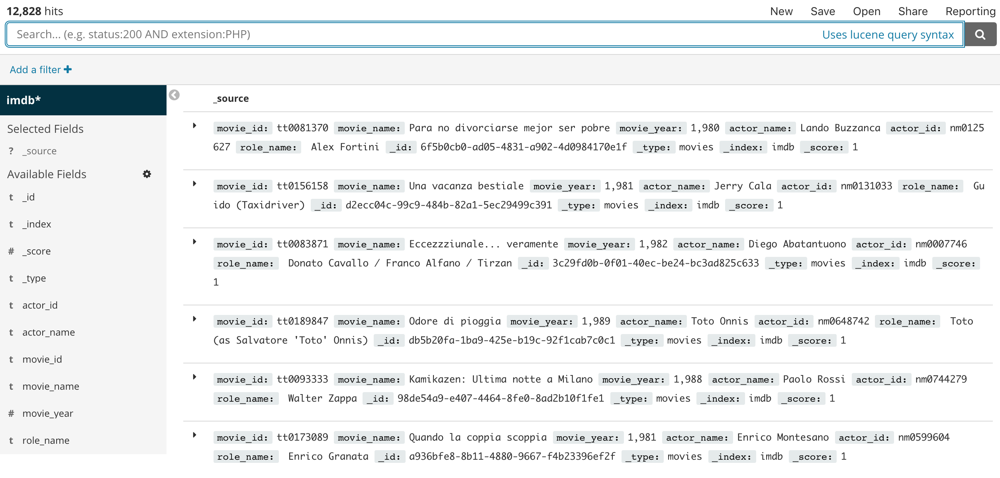
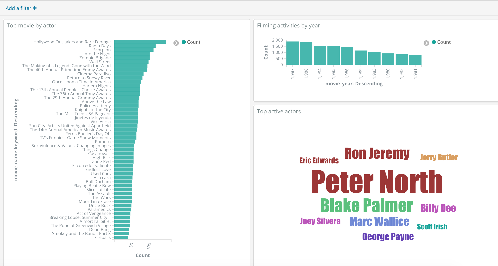
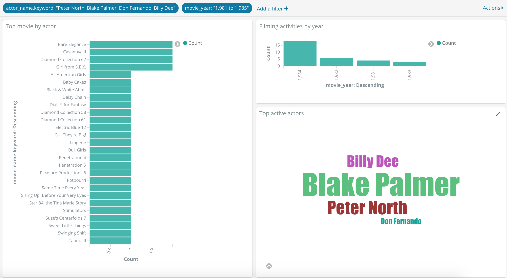
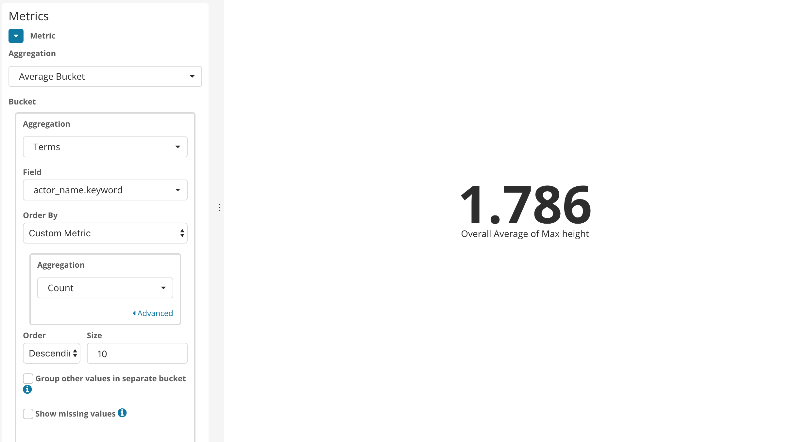
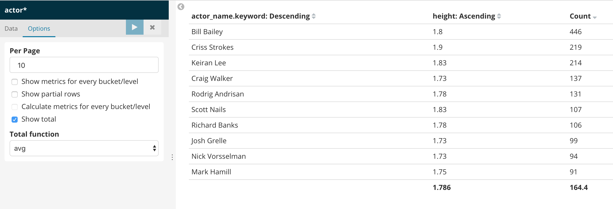

# Lab session #7: Using the Elastic Stack to study scraped data from a web page

### Universitat Politècnica de Catalunya

Course link: [ccbda-upc.github.io](https://ccbda-upc.github.io/).

Group 1207

-   Quang Duy Tran - duy9968\@gmail.com

-   Marc Garnica Caparros - marcgarnicacaparros\@gmail.com

Assignment link: [Lab 7 Assignment](https://github.com/CCBDA-UPC/Assignments-2018/blob/master/Lab07.md)

Scrappy-lab repository: [scrappy-lab](https://github.com/marcgarnica13/scrapy-lab)

## Objectives

In this lab session it has been used the [Scrapy framework](https://scrapy.org/) of python for a highly active web scraping. Finally the Elastic Stack has been implemented to study the obtained massive data from the web.

## Lab tasks

### Task 7.1: Extract selected information from a newspaper webpage

- [x] Scrappy installation and scrappy shell hands on.

- [x] Scrappy auto generations of projects with ```scrapy startproject <project_name>``` and template for web spiders with ```scrapy genspider <spider_name> <start_url>```

- [x] Spider first experience with [nytimes.py](https://github.com/marcgarnica13/scrapy-lab/blob/master/nytscraper/spiders/nytimes.py).

- [x] Execute scrapy spiders from a python script with:

```python
from scrapy import cmdline

cmdline.execute("scrapy crawl nytimes -o nytimes.json".split())
```

- [x] Storing scraped data from www.nytimes.com in a [nytimes.json](./scrapy_data/nytimes.json)

### Task 7.2: Obtain a subset of the movie industry to do some research

Scrapping the [Internet Movie Database](https://www.imdb.com/) for information retrieval as authors and films.

- [x] Analysing Forrest Gump movie full credits [page](https://www.imdb.com/title/tt0109830/fullcredits/)

<p align="center"></p>

- [x] Spider class in [forrestGump.py](https://github.com/marcgarnica13/scrapy-lab/blob/master/nytscraper/spiders/forrestGump.py)

- [x] Extracting the list of actors of Forrest Gump movie

  ```python
  class ForrestgumpSpider(scrapy.Spider):
      name = 'forrestGump'
      allowed_domains = ['www.imdb.com']
      start_urls = ['https://www.imdb.com/title/tt0109830/fullcredits//']

      def parse(self, response):
          movie_id = response.url.split('/')[4]
          movie_info = response.css('div.parent>h3')
          movie_name = cleanString(movie_info.css("a::text").extract_first())
          movie_year = cleanString(movie_info.css("span::text").extract_first())

          movie_date = datetime.strptime(movie_year[2:-2], '%Y')
          initDate = datetime.strptime('1980', '%Y')
          endDate = datetime.strptime('1990', '%Y')

          if movie_id == 'tt0109830' or (movie_date > initDate and movie_date < endDate):
              table = response.css("table.cast_list")
              for row in table.xpath("//tr[@class='odd' or @class='even']"):
                  actor_info = row.css('td.itemprop')
                  actor_name = cleanString(actor_info.css('a>span::text').extract_first())
                  actor_id = cleanString(actor_info.css('a::attr(href)').extract_first().split('/')[2])
                  character = row.css('td.character>a::text').extract_first()
                  if character is None:
                      character = cleanString(row.css('td.character::text').extract_first())
                  yield {
                      "movie_id" : movie_id,
                      "movie_name" : movie_name,
                      "movie_year" : movie_year[2: -2],
                      "actor_name" : actor_name,
                      "actor_id" : actor_id,
                      "role_name" : character
                  }
  ```

  As we can see from the code:
  - The spider is identifying the **html table** containing the complete cast with its **class = cast_list**.
  - Extracting each of the **html tr rows** from that table with [xpath selector](https://doc.scrapy.org/en/0.12/topics/selectors.html) looking for all the tr with either class odd or even.
  - Extracting actor name and id from the **td with class = itemprop** and the text in the **span tag inside the a tag** or the **href attribute of the a tag** respectively.
  - Extracting the role played by the actor in the text of the **td with class character**.
  - Finally is storing all this attributes in a json object saved in the resulting file.

- [x] Deeper scrapping into the bio page of the author to know some personal information and extracting all the other films where the actors participated and parsing their full cast again recursively. Finally, this is the complet spider class:

  ```python
  class ForrestgumpSpider(scrapy.Spider):
      name = 'forrestGump'
      allowed_domains = ['www.imdb.com']
      start_urls = ['https://www.imdb.com/title/tt0109830/fullcredits//']
      #start_urls = ['https://www.imdb.com/name/nm0000158/bio/']

      def parse(self, response):
          movie_id = response.url.split('/')[4]
          movie_info = response.css('div.parent>h3')
          movie_name = cleanString(movie_info.css("a::text").extract_first())
          movie_year = cleanString(movie_info.css("span::text").extract_first())

          movie_date = datetime.strptime(movie_year[2:-2], '%Y')
          initDate = datetime.strptime('1980', '%Y')
          endDate = datetime.strptime('1990', '%Y')

          if movie_id == 'tt0109830' or (movie_date > initDate and movie_date < endDate):
              table = response.css("table.cast_list")
              for row in table.xpath("//tr[@class='odd' or @class='even']"):
                  actor_info = row.css('td.itemprop')
                  actor_name = cleanString(actor_info.css('a>span::text').extract_first())
                  actor_id = cleanString(actor_info.css('a::attr(href)').extract_first().split('/')[2])
                  character = row.css('td.character>a::text').extract_first()
                  if character is None:
                      character = cleanString(row.css('td.character::text').extract_first())
                  yield {
                      "movie_id" : movie_id,
                      "movie_name" : movie_name,
                      "movie_year" : movie_year[2: -2],
                      "actor_name" : actor_name,
                      "actor_id" : actor_id,
                      "role_name" : character
                  }

                  actor_url = "https://www.imdb.com/name/" + actor_id
                  actor_bio = actor_url + "/bio"
                  yield scrapy.Request(actor_url, callback=self.parse_actor_movies)
                  yield scrapy.Request(actor_bio, callback=self.parse_actor_bio)

      def parse_actor_movies(self, response):
          actor_section = response.xpath('//div[@id="filmo-head-actor"]/following-sibling::div[1]')
          for row in actor_section.xpath("//div[@class='filmo-row odd' or @class='filmo-row even']"):
              movie_to_parse = row.css('b>a::attr(href)').extract_first().split('/')[2]
              movie_url = 'https://www.imdb.com/title/' + movie_to_parse + '/fullcredits'
              yield scrapy.Request(movie_url, callback=self.parse)

      def parse_actor_bio(self, response):
          bio = {}
          bio['authorId'] = response.url.split('/')[4]
          for row in response.xpath('//table[@id="overviewTable"]//tr'):
              label = row.css('td.label::text').extract_first()
              #value = row.css('td::text')
              value = cleanString(row.css('td::text').extract()[1])
              if label == 'Born':
                  for data in row.css('td>time>a::text').extract():
                      value += cleanString(data) + ' '
                  value += cleanString(row.css('td>a::text').extract_first())
              bio[label] = value
          yield bio
  ```

  The bio information of the actor is parsed dynamically looking into the **html table overviewTable**. The final result will include as many information as each actor table will have. Some examples are *Born, Birth Name, Died, Height* and others.

  The list of movies of one of the actors is obtained by analysing the **dropdown Actor** on the main page of the actor and extracting all the movie links.

  Finally this links are again parsed by the main parse of the class if they were produced in the 80s

    ```python
    movie_date = datetime.strptime(movie_year[2:-2], '%Y')
          initDate = datetime.strptime('1980', '%Y')
          endDate = datetime.strptime('1990', '%Y')

          if movie_id == 'tt0109830' or (movie_date > initDate and movie_date < endDate):
            ##parse movie only if it is the first or if it was produced in the 80s
    ```

 - [x] Storing the big amount of data extracted in [imdb.json](./scrapy_data/imdb.json)

### Task 7.3: Study the obtained data using the Elastic Stack

In this section, we scrap the data from IMDb and put them into Elastic Stack instead of local json file.

- [x] The spider class can be found in [this link](https://github.com/marcgarnica13/scrapy-lab/blob/master/nytscraper/spiders/movieSearch.py).

It simply replaces the `yeild` by inserting data rows into Elasticsearch under the index `imdb`

```python
es=Elasticsearch(host=ELASTIC_API_URL_HOST,
                 scheme='https',
                 port=ELASTIC_API_URL_PORT,
                 http_auth=(ELASTIC_API_USERNAME,ELASTIC_API_PASSWORD))
                 
es.index(index='imdb',doc_type='movies', id=uuid.uuid4(), body={
                    "movie_id" : movie_id,
                    "movie_name" : movie_name,
                    "movie_year" : movie_year[2: -2],
                    "actor_name" : actor_name,
                    "actor_id" : actor_id,
                    "role_name" : character
                    })
```

- [x] After running the above file for a while, the data obtained can be shown in Kibana



- [x] From the data, we can explore some useful knowledge from them, using the views in Visualize tab. With the filter option, we can get only the data rows that we are interested.


The dashboard has 3 charts, showing filming activities by years, movies with most actors and most active actors.


We applied 2 filters to the dashboard, showing only records from several actors, between the year 1981 and 1985.

In the next section, we decided to answer your example question in the requirement, as it is quite interesting and challenging. The goal is to find the average height of top 10 actors in a period studied. 

The current data structure we put on Elasticsearch does not provide enough information for the answer, hence we need to change the code. The new file is in [actors.py](https://github.com/marcgarnica13/scrapy-lab/blob/master/nytscraper/spiders/actors.py).

```python
start_urls = ['https://www.imdb.com/name/nm0262635/']

def parse(self, response):
        starting_year = 2010
        
        actor_id = response.url.split('/')[4]
        actor_name = cleanString((response.xpath("//td[@id='overview-top']/h1/span/text()") or response.xpath("//td[@id='overview-top']/div[@class='no-pic-wrapper']/div[@class='no-pic-text-column']/h1/span/text()")).extract_first()) 

        try:
            height = cleanString(response.xpath("//div[@id='details-height']/text()").extract()[1])
            height_in_m = float(re.search('[0-9]\.[0-9]+', height).group(0))
        except Exception:
            height_in_m = None 
        if (height_in_m is not None):
            actor_table = response.xpath("//div[@id='filmo-head-actor']/following::div[@class='filmo-category-section'][1]")
            for row in actor_table.xpath(".//div[@class='filmo-row odd' or @class='filmo-row even']"):
                try:
                    movie_year_raw = cleanString(row.css('span.year_column::text').extract_first())
                    movie_year = int(re.search('[0-9]{4}', movie_year_raw).group(0))
                except Exception:
                    movie_year = None
                if (movie_year is not None and movie_year >= starting_year):
                    movie_name = cleanString(row.css('b>a::text').extract_first())
                    movie_id = cleanString(row.css('b>a::attr(href)').extract_first().split('/')[2])
                    es.index(index='actor_height',doc_type='actor', id=uuid.uuid4(), body={
                        "actor_id" : actor_id,
                        "actor_name" : actor_name,
                        "height" : height_in_m,
                        "movie_name" : movie_name,
                        "movie_id" : movie_id,
                        "movie_year" : movie_year 
                    })
                    movie_url = 'https://www.imdb.com/title/' + movie_id + '/fullcredits'
                    yield scrapy.Request(movie_url, callback=self.parse_movie)

    def parse_movie(self, response):
        table = response.css("table.cast_list")
        for row in table.xpath("//tr[@class='odd' or @class='even']"):
            actor_id = cleanString(row.css('td.itemprop>a::attr(href)').extract_first().split('/')[2])
            actor_url = "https://www.imdb.com/name/" + actor_id
            yield scrapy.Request(actor_url,callback=self.parse)
```

We will start crawling from an actor's site, getting all of his movie under the Actor credits section, from his movies, we will do the same for his co-actors.
Since we are interested in finding the average height, actors without height info will be omitted. A row in Elasticsearch will consist of movie name, movie id, actor id, actor name, actor height.

From the data we have, we can now answer the question using Visualize.



To get the final number, Metric visualization is used. The answer is get by Average Bucket, where bucket is records count, grouped by `actor_name`, in descending order and the size of 10.

In order to make sure the final number is correct, we use Data Table to double check by getting top 10 active actors, their records, their height and calculate the average.



#### Difficulties

In this lab, we had spent more or less 15 hours working. The most difficult thing we find is how to select and navigate the HTML elements with XPath and CSS response. Also using selecting the right parameters in Kibana visualization tool was a bit confusing. 