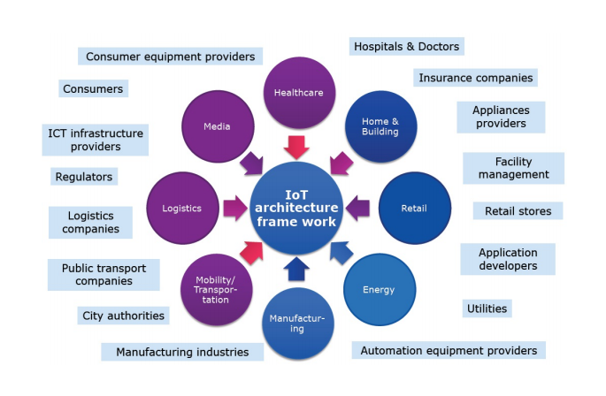
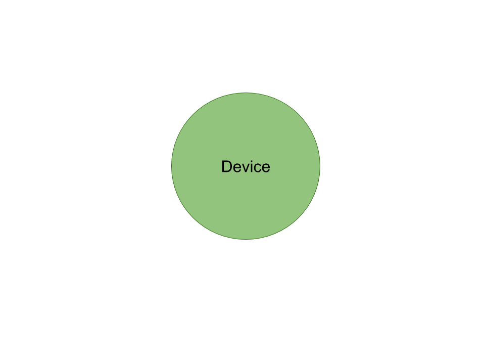
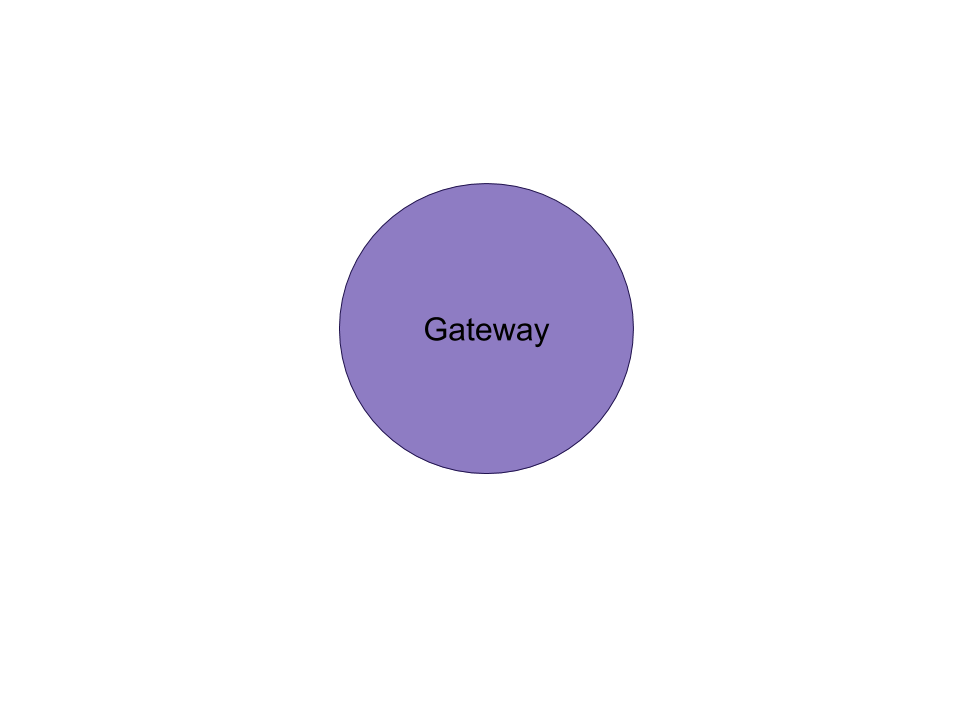
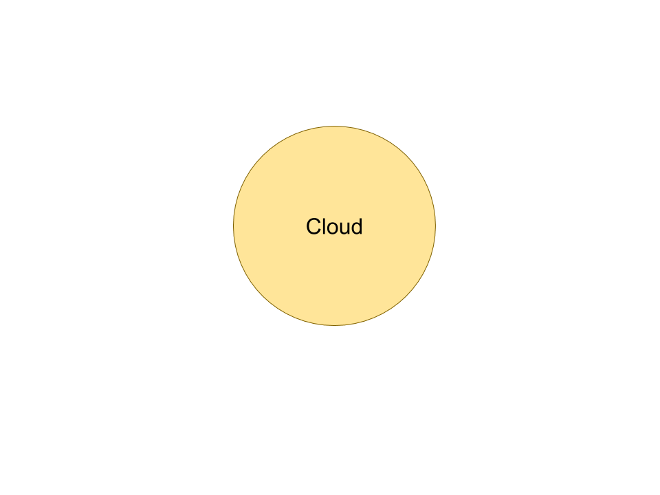

# Breaking down the **Internet of Things** infrastructure

### Universitat Politècnica de Catalunya

-   Quang Duy Tran - duy9968\@gmail.com

-   Marc Garnica Caparros - marcgarnicacaparros\@gmail.com

## Abstract

The most common concepts related to Internet of Things and IoT innovation projects are sensors, biometrics, connected assets or any other machine smartly connected to a network. The general idea uses to forget the network configurations and technologies, cloud databases and stream managing systems with a key role to make an IoT ecosystem work. This project tries to expalin in detail the needed backend behind any IoT deployment with the focus on the cloud infrastructure needed for such a system.

## Table of contents

* [1. Internet of Things: Overview](#Overview)
* [2. Architecture deployment](#Architecture)
  * [2.1. Device - Gateway - Cloud](#Architecture_triplet)
  * [2.2. Pipelining and Dataflow](#Architecture_pipelining)
* [3. Type of information](#Information)
* [4. Device](#Device)
* [5. Gateway](#Gateway)
* [6. Cloud](#Content6)
  * [6.1. Architecture](#Cloud_architecture)
  * [6.2. Ingestion](#Cloud_ingestion)
  * [6.3. Data storage](#Cloud_storage)
  * [6.4. Rule processing and stream analytics](#Cloud_stream)
  * [6.5. Analytics](#Cloud_analytics)
  * [6.6. Archival Storage (A.P.I)](#Cloud_api)
* [7. Providers](#Providers)
* [8. Use cases](#UseCases)

<a name="Overview"/>

## 1. Internet of Things: Overview

Through the years there has not been any agreement on the IoT system definition. The term Internet of Things is usually referring to use cases and scenarios where network connectivity and computing capability extends to objects such as sensors or any other day to day item not normally considered computers. All this new devices are connected to the Internet which enables them generate, exchange and consume data with minimal human intervention.

[OASIS](https://www.oasis-open.org/) defined in 2014 the Internet of Things as a "System where the Internet is connected to the physical world via ubiquitous sensors".

**Which is the impact of Internet of Things?** Numerous companies and organizations are investing a lot of money on improving and facilitating IoT ecosystem, going from the smart connected devices to communication protocols or stream analysis systems. The impact of IoT in our processes and business has still not being able to be measure because as it is shown in the following image, it is potentially present in every sector of our life.

Iot systems could be connected versions of common objects familiar in a daily word or also purpose-built devices for functions not yet realized. Including all the specific use cases and opportunities in the same standards and definitions is an impossible task, with the extra complexity of having to deal with *diverse hardware, diverse OS and softwares and different network requirements*.

All in all, building and end-to-end IoT solution is more than connecting devices through the network and requires a powerful and well designed infrastructure behind.

<a name="Architecture"/>

## 2. Architecture deployment

In order to build a strong and sustainable IoT system, the architecture design needs to be robust, integrated and strongly connected in order to carry the data from the devices to the very end where the insights and analytics will be the core of any data-driven decisions systems.

In a first abstract level, the system can be divided in three basic components or stages: Device - Gateway - Cloud.

<a name="Architecture_triplet"/>

### Device - Gateway - Cloud

|  |  |  |
| :--------------------------- | :----------------------------- | :------------------------- |
| *Device*: | *Gateway*: | *Cloud*: |
