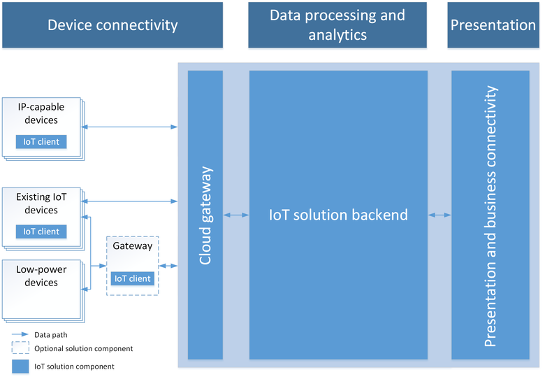
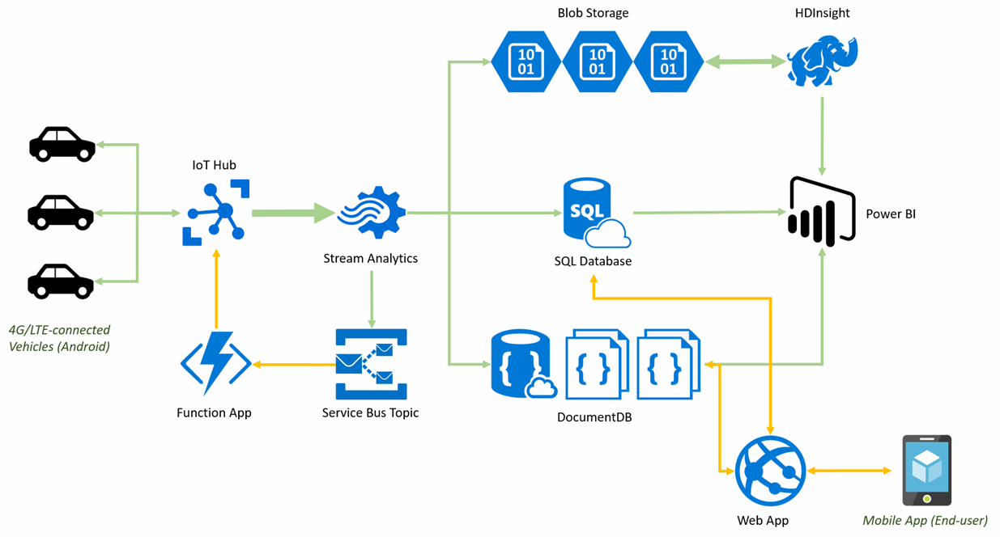

# Breaking down the **Internet of Things** infrastructure

### Universitat Politècnica de Catalunya

-   Quang Duy Tran - duy9968\@gmail.com

-   Marc Garnica Caparros - marcgarnicacaparros\@gmail.com

## Abstract

The most common concepts related to Internet of Things and IoT innovation projects are sensors, biometrics, connected assets or any other machine smartly connected to a network. The general idea uses to forget the network configurations and technologies, cloud databases and stream managing systems with a key role to make an IoT ecosystem work. This project tries to explain in detail the needed backend behind any IoT deployment with the focus on the cloud infrastructure needed for such a system.

## Table of contents

* [1. Internet of Things: Overview](#Overview)
* [2. Architecture deployment](#Architecture)
  * [2.1. Device - Gateway - Cloud](#Architecture_triplet)
  * [2.2. Pipelining and Dataflow](#Architecture_pipelining)
* [3. Device](#Device)
  * [3.1. Type of information](#DeviceInformation)
  * [3.2. Metadata](#DeviceMetadata)
  * [3.3. Management](#DeviceManagement)
* [4. Gateway](#Gateway)
* [5. Cloud](#Cloud)
  * [5.1. Ingestion](#Cloud_ingestion)
  * [5.2. Data storage](#Cloud_storage)
  * [5.3. Rule processing and stream analytics](#Cloud_stream)
  * [5.4. Analytics](#Cloud_analytics)
  * [5.5. Archival Storage (A.P.I)](#Cloud_api)
* [6. Providers](#Providers)
* [7. Conclusions](#Conclusions)

<a name="Overview"/>

## 1. Internet of Things: Overview

Through the years there has not been any agreement on the IoT system definition. The term Internet of Things is usually referring to use cases and scenarios where network connectivity and computing capability extends to objects such as sensors or any other day to day item not normally considered computers. All this new devices are connected to the Internet which enables them generate, exchange and consume data with minimal human intervention.

[OASIS](https://www.oasis-open.org/) defined in 2014 the Internet of Things as a "System where the Internet is connected to the physical world via ubiquitous sensors".

**Which is the impact of Internet of Things?** Numerous companies and organizations are investing a lot of money on improving and facilitating IoT ecosystem, going from the smart connected devices to communication protocols or stream analysis systems. The impact of IoT in our processes and business has still not being able to be measure because as it is shown in the following image, it is potentially present in every sector of our life.

<p align="center"></p>

Iot systems could be connected versions of common objects familiar in a daily word or also purpose-built devices for functions not yet realized. Including all the specific use cases and opportunities in the same standards and definitions is an impossible task, with the extra complexity of having to deal with *diverse hardware, diverse OS and softwares and different network requirements*.

All in all, building and end-to-end IoT solution is more than connecting devices through the network and requires a powerful and well designed infrastructure behind.

<a name="Architecture"/>

## 2. Architecture deployment

In order to build a strong and sustainable IoT system, the architecture design needs to be robust, integrated and strongly connected in order to carry the data from the devices to the very end where the insights and analytics will be the core of any data-driven decisions systems.

In a first abstract level, the system can be divided in three basic components or stages: Device - Gateway - Cloud.

<a name="Architecture_triplet"/>

### 2.1. Device - Gateway - Cloud
<table width="100%">
  <tr>
  <td width="33%">
    <strong>Device</strong>
  </td>
  <td width="33%">
    <strong>Gateway</strong>
  </td>
  <td width="33%">
    <strong>Cloud</strong>
  </td>  
  </tr>

  <tr>
  <td width="33%">
    <p align="center"></p>
  </td>
  <td width="33%">
   <p align="center"></p>
  </td>
  <td width="33%">
  <p align="center"></p>
  </td>  
  </tr>

  <tr>
  <td width="33%">
    First level of interaction with the real word by hardware and software tools. Devices might be directly or indirectly connected with each other through Internet. Devices includes anything from legacy industrial devices to robotic camera systems, water-level detectors, air quality sensors, accelerometers, and heart rate monitors. They can be dedicated machines or applications in computers or smart-phones.
  </td>
  <td width="33%">
    Gateways enables devices directly or indirectly connected to reach cloud services and storage. They can also add some functionalities and early processing of data.
  </td>
  <td width="33%">
    Cloud services is the most used and most efficient solution in order to consume the huge amount of data your IoT ecosystem will be producing. Without any limitation, IoT Cloud component includes any sort of Cloud system applications: Static content, autoscaling groups, Big Data Management Systems, SQL and NoSQL distributed databases and Streaming analytics and rule processing workflows.
  </td>  
  </tr>
</table>

<a name="Architecture_pipelining"/>

### 2.2. Pipelining and dataflow

The architecture of *Device-Gateway-Cloud* can also be analyzed from a very equivalent paradigm where the IoT systems are seen as a **Pipeline of Data and components** or usually called a **Dataflow**.

<p align="center"></p>

On **stage 1** the system is basically collecting data form the environment or the object of measurement and transforming it into useful raw data. Some new technologies enable some initial data processing in stage 1. Systems always needs to balance between having all the possible data with a late processing or interact with the insights directly with early as possible processing of the data. This stage is completely done in the Device components.

**Stage 2** is in charge of gathering the data collected in stage 1. Gateway component is the main actor in this stage. The raw and analog data from the devices needs to be aggregated and converted into digital streams in order to be processed further in the analytics systems. This conversion and aggregation is usually performed in the Data Acquisitions Systems. The data is transferred by wire, WI-FI or the Internet. Intelligent gateways can also enrich the data received by means of malware protection, analytics and data management services.

After the two first stages and having the data digitalized and aggregated, it is time to cross the IT Edge and start performing analytics and building on top of the data. **Stage 3** and **Stage 4** are mainly located in the Cloud component.

As a first reasoning, one can fall into the error of directly pipe the data coming from stage 2 to the data center in stage 4. Having one large data pipe it requires an enormous capacity, in terms of storage and data processing. Stage 3 is focused on preprocessing and early managing the data, this is extremely useful to first, move on only on the meaningful data and second filter and divide the data for a better management later. Real time dashboards and emergency systems can also benefit of this intermediate stage 3.

The final stage of the data flow is where the powerful utilities of an IoT ecosystem can really be raised up. Data centers and data management services in this stage have three main objectives:

 - Data management purposes in order to store the data and the insights in the most efficient way.
 - In-depth processing and analytics on the data. Providing data visualization, commanding and interpretation tools for the decision systems.
 - Managing a exhaustive archive of the system data and opening the data to the required stakeholders. It is as important as achieving results as having the ability to go back through the data to identify errors or further analysis. For example creating an API to consume the data filtered by date or type.

<a name="Device"/>

## 3. Device

As presented in the previous section of this document, device components involves any resource (hardware or software) able to capture data frames and measurements from the environment. It is a crucial component in any IoT ecosystem. Without really going into detail about the mechanisms and functionalities of the devices and machines, the main features to understand in order to design a robust ecosystem are **Type of Information**, **Metadata and Commands** and **Device management**.

<a name="DeviceInformation"/>

### 3.1. Type of information

Each resource has the capability to consume or produce various type of information. The system needs to be aware of these types and manage and process it accordingly. Along with the measurements and telemetry data recorded in the devices they also keep information about their state.

<a name="DeviceMetadata"/>

### 3.2. Metadata and Commands

The amount of metadata that a device can include highly depends on each device manufacturers. Some resources only include the minimum metadata which is the properties of the device and the telemetry definitions. Some other enriched devices can even keep further information about the device metadata and even emit tags related to their environment for further analysis or commands to interact with them. This is a very simple example of device metadata:

```json
{
  "DeviceProperties": {
    "DeviceID": "deviceid1",
    "HubEnabledState": null,
    "CreatedTime": "2016-04-25T23:54:01.313802Z",
    "DeviceState": "normal",
    "UpdatedTime": null
    },
  "SystemProperties": {
    "ICCID": null
  },
  "Commands": [],
  "CommandHistory": [],
  "IsSimulatedDevice": false,
  "id": "fe81a81c-bcbc-4970-81f4-7f12f2d8bda8"
}
```

Device commands are defined as actions that operate directly in the device. Depending on the type of device and infrastructure this can be very useful for the system to interact with the environment and the choices of implementation. Being able to operate on the devices it is a very powerful tool but it also implies some drawbacks such as ambiguity in the device state, semantics development for the commands and command expiration management (commands should not live forever).

<a name="DeviceManagement"/>

### 3.3. Management

As any other IT asset management, devices (and gateways) require a rigorous management involving provisioning, operating and updating the devices. The majority of the devices in the market offer fully integrated managing systems including registration, authentication and authorization of the resources. Moreover a Logging system sampling the events generated by the devices and their state it is also useful to track the system back for checkpoints.

In some deployments, updating the devices can be a very time-consuming task and not practical at all. A very intuitive solution is to use the already deployed connection between devices and the network to propagate the commands and updates. This is the idea of over-the-air updates and IoT management technologies such as [Android Things](https://developer.android.com/things/) or Debian package repositories (APT) in Cloud Platforms or [Resin.io](https://resin.io/).

The following image shows an example of a IoT sensors management system implement by Ajuntament de Barcelona with mainly sound sensors in Barcelona

<p align="center"></p>

<a name="Gateway"/>

## 4. Gateway

The gateway component is sometimes underrated in how big is his impact in the ecosystem. When managing huge networks of devices it is important to deploy the correct and accurate gateway installation to transfer and propagate the operations in an efficient, controlled and fast manner.

Huge data networks are usually working with different data transfer protocols depending on the environment and the devices connected, gateways are in charge of translate and encapsulate the data transfer protocols and make all the nodes interconnected semantically. Usually it is correct to claim that a gateway works as proxy, receiving data and packaging if for transmission. Several levels of hierarchy in the gateway deployment are used to distribute the effort and organized the data transfer.

In most of the cases it is the gateway the first point where the data is open to the Internet navigation, specially for such devices with network limitation like Bluetooth or Peer2Peer devices.

This safe connectivity brings to the gateways the responsibility to manage the updates commanded and also apply some business logic into the data that will make the transfer and archival of the data easier.

<a name="Cloud"/>

## 5. Cloud

The three components of an IoT architecture play a key role for achieving the objectives but in terms of impact over the analysis into the data and the final usage of the system the Cloud infrastructure is the most important piece of the system. As explained before, in this component is where **stage 3** and **stage 4** are executed from the [DataFlow](#Architecture_pipelining).

The main steps through which the data will be going are basically the following:
 - Data ingestion.
 - Data storage.
 - Rule processing and stream analytics.
 - Analytics.
 - Archival Storage.

<a name="Cloud_ingestion"/>

### 5.1. Ingestion

Data ingestion is the process of importing, transferring, loading and processing the data before parsing to the next step for storage. It is the first step of building the pipeline, which could also be the most difficult one to handle. It has to deal with data variety and velocity, coming from a large number of different sources. The volume is also a huge challenge, for example, according to Cisco, sensors from a Boeing 787 jet generates around 40 terabytes of data per hour during flight. The process involves prioritizing data, validating and routing them to the preferred destination.

Data coming from various sources are often diverse, ingestion system will needs parameters to treat those different kind of data. They vary in velocity and size since data sources can be machine, network or human interaction. Data can be ingested in real time or by batches. Real time data are digested immediately as soon as it arrives, while batch data are processed in block in fixed time intervals. Also, different data have different format, they can be either structured, unstructured or semi-structured.

Unlike web or media data which are human-generated, IoT data are generated by machines and sensors which are tremendously higher in term of volume and velocity. Such amount of data creates huge challenges for data ingestion systems, in time and resources. To handle the data proficiently, it needs to be designed to allow rapid consumption of data, able to cope with changes in data and data sources, scalable to the  amount of input and fault tolerant.

Moreover, there are several fundamental principles that the system should be capable to handle:
 - Network bandwidth: as the traffic can increase and decrease in time, network scalability plays a key role in data pipelining. Tools for bandwidth throttling and compression are required to ensure the stability of data stream.
 - Heterogeneous technologies: data ingestion system often needs to get data from different data sources and operating system.
 - Suitable data format: data from diverse formats are integrated and serialized. The right format will facilitate reading and understanding data.

Before storing data, we will need to preprocess it in order to maximize the amount of useful data. Some contain noise or repeating data that we would try to avoid. One technique often used is filtering. As data is generated by sensors, the measured numbers fluctuate very slightly and can be almost identical, thus storing all of them is unnecessary and wasting our resources. We can run algorithm to pick the helpful information and discard the redundant ones without losing much information. The figure below demonstrates how stored data can be reduced.

<p align="center"></p>

<a name="Cloud_storage"/>

### 5.2. Data storage

After being “ingested”, data is stored in order to be used for processing and analytics. There are mainly two types of data that needed to be stored: small data from sensors that are written frequently and larger multimedia data.

Data from sensors can be sent in **real-time** or in **batches**, depend on the device and the network. Whatever the sending interval is, the order of data written is prominent. For most Internet of Things application, time-series data need to be accurate in order to be analyzed properly. For example, data generated from an airplane, where a large number of sensors are used, should be synchronous with each other. An unaligned system would fail to analyze and detect the problem.

There could be millions of devices sending data to a storage, hence the desired databases needs to handle the tremendous amount of constant writing. For this type of work, NoSQL databases, including HBase, Cassandra, were proven to have high performance. HBase was faster in read-intensive system, while Cassandra is well capable in intensive writing with little delay. To maintain processing the data over time, database systems are distributed to multiple nodes. If a node fails to connect to the network, others can still continue to handle when data come in, ensuring the flow of data is not discontinued.

In contrast with sensor data, multimedia data are much larger in size. Multimedia can be in the form of text, picture, audio, video. Its application can vary from entertainment, education to journalism, surveillance. For this type of data, storing using Binary Large Object (BLOB) is used to optimize the performance. BLOB is a collection of unstructured, binary data stored in a single entity. MySQL with BLOB was showed to write multimedia effectively, compared to NoSQL databases such as MongoDB, as it stores data in one single BLOB, while MongoDB split the files and store in small chunks with extra information such as metadata, hence creating latency. However, MongoDB would shard the database to multiple nodes, providing decentralization and scalability.


<a name="Cloud_stream"/>

### 5.3. Rule processing and stream analytics

Conventional analytics often use historical data in transaction systems or aggregated data in data warehouses. However, as the world is changing quickly, business and organization are now moving to near real-time. IoT data could have short life and lose value quickly if they are not used in time. We might wants to make decision on data within minutes, not in days or even weeks. Come back to our example of airplanes, the system should be able to analyze and act immediately to the frauds, make needed changes or notify the controller. There are many more industrial applications where response time is sensitive, such as cyber security, energy, supply chain, real time marketing.

As soon as data arrives, rule processing can be used to trigger alerts, filter data or invoke other system. It is done in memory, based on rules which were pre-defined. The pipeline then continues with streaming system which perform ideally real-time analytics, dealing with high speed and sheer volume of data to gain insights. The operation includes aggregation, pattern detection, correlations, etc.

One of the most popular platform is Apache Storm, which is a free, open source distributed realtime computing system, used by many companies including Yahoo, Twitter, Spotify. To be fault-tolerant, the workload are distributed along the nodes in a cluster. Each node has the ability to process million tuples per second and all data are made sure to be handled exactly once. Both streaming and batch data can be processed.

<a name="Cloud_analytics"/>

### 5.4. Analytics

Apart from approximately real-time analysis, the sheer volume of data accumulated provide a potentially rich source of information. The aim of analytics is discover novel, interesting knowledge, helping in predicting, identifying trends, finding hidden information, detecting pattern and making decisions. Most of big data analytics are developed using data mining methods, including classification, clustering, association rule mining. Each method has it own application in extracting knowledge from data.

Classification is a function that assigns items to target categories or label, using supervised learning approach. The goal is to predict correctly the unknown class of new input data. A set of previous labeled data, known as the training set, is firstly learned to build the model. Based on similarity with training data points, new data are classified to pre-defined classes. Classification is used in natural language processing, pattern recognition, computer vision, etc.

Unlike classification which is based on supervised learning, clustering is another data mining methods using unsupervised learning. From a set of new data, data points are divided into different groups, also known as clusters, where elements inside are more similar to each other than to those in other groups. This method is widely used in market research, where alike customers are grouped into market segments, to deliver better and suitable services.

Association rule mining is used in identify relationships among different objects or events, based on the frequency of occurrences in data. Discovered rules are required to satisfy user-defined minimum support (how frequently the rule appears in dataset) and minimum confidence (how often the rule has been found to be true). Association rule is often used to analyze market trends, consumer buying behavior.

<a name="Cloud_api"/>

### 5.5. Archival storage (A.P.I)

Although all data are stored in the system, there are data that are accessed periodically, while the others can stay unused for a long period of time. Hence, data are divided into different storage classes. Actively used data are kept in high performance storage region and infrequently ones are put in archival storage for probable future uses. It is common to have confusion between data archives and data backup. While backup is used to recover database in case of frauds, data archives keep occasionally accessed data or older version of changed data. Multimedia data are often put in archival storage after being processed since they are not used regularly.

Based on frequency of accesses, data are automatically moved between classes. A single API is provided to access all region of data, reducing redundant workload for methods calling them.

<p align="center"><br>Different storage classes of Google Cloud</p>

<a name="Providers">

## 6. Providers

Since the emerging of the IoT ecosystems and all its potential, several companies have been working on offering IoT infrastructure in the Cloud. The functionalities included extend from the very first devices and sensors to the most advanced analytics on the fly and storage capabilities.

An extended research on the most used and reliable IoT Cloud providers can be accessed in this [Article from the DevTeam.Space](https://www.devteam.space/blog/10-best-internet-of-things-iot-cloud-platforms/).

  - [Amazon Web Services IoT Platform](https://aws.amazon.com/iot-core/)
  - [Microsoft Azure IoT Hub](https://azure.microsoft.com/en-us/services/iot-hub/)
  - [IBM Watson IoT Platform](https://www.ibm.com/us-en/marketplace/internet-of-things-cloud)
  - [Google Cloud Platform](https://cloud.google.com/iot-core/)
  - [Oracle](https://www.oracle.com/solutions/internet-of-things/)
  - [Salesforce](https://www.salesforce.com/products/salesforce-iot/overview/)
  - [Bosch](https://www.bosch-si.com/iot-platform/iot-platform/iot-platform.html)
  - [CISCO IoT Cloud Connect](https://www.cisco.com/c/en/us/solutions/service-provider/iot-cloud-connect/index.html)
  - [General Electrics Predix](https://www.predix.io/)
  - [SAP](https://cloudplatform.sap.com/index.html)

Although it may look as a topic, deciding which one to use it is a tough topic, it will ultimately depend on the specific needs of your business. For the scope of this project, it has been briefly documented the functionalities of Amazon Web Services IoT Platform, Google Cloud Platform, and Salesforce.

<a name="aws_eval">

### 6.1 AWS IoT Core

As it is for other Cloud solutions, Amazon Web Services represents having operating a public cloud infrastructure around the world in an easy way and including a diverse portfolio of deployments. All the known Amazon services are well connected with AWS IoT Core such as AWS EC2, S3 buckets. [AWS Kinesis (Streaming Analytics)] and [Amazon SQS (Message Queue)] can be used for rule engines and streaming analytics platform for IoT.

The full AWS IoT Core package includes an ingestion system and rule engines generations which directly connects to any of the AWS Endpoints.

<p align="center">

</p>

On the other hand, it requires an extensive knowledge of AWS partners and includes a considerable high vendor lock in with AWS SDK pacakges for devices. When it comes to **pricing**, in AWS IoT you pay only for what you sue with no minimum service usage. The services used in IoT Core are connectivity, messaging, registry, rules engine (triggers).

<a name="google_eval">

### 6.2 Google Cloud Platform IoT Core

Google Cloud Platform IoT is one of the newest cloud as a service infrastructures for IoT generally available and it offers a considerably huge portfolio of service to use. One of their main competitive advantages is the compatibility with most of the private devices in the market with a simple SDK included in most of the Android and Raspberry PI distributions. Cloud Functions will work as a trigger systems for both, data organization and load and device updates and management.

Cloud Pub/Sub works as a reliable message ingestion services and it enables the user to create topics for streams or channels. (Similar concept to the AWS subscriptions). Moreover, Google Cloud Dataflow provides the open Apache Beam programming model as a managed service for multi-way processing of data: from batch operations, extract-transform-load (ETL) patterns, and continuous, streaming computation (small and iterative batch operations). Cloud Dataflow has been specifically designed to manage high-volume pipelines of data, common scenario in IoT ecosystems. Cloud Bigtable along with Cloud Datalab are large-scale platforms for analytics.

The IoT core provides full integration with any other Google Cloud Services such as Google Cloud Data Studio or the machine learning module Cloud ML, with Tensorflow as one of the main applications. Finally Google Cloud Storage provides a single API for used objects and archival data.

<p align="center">
 
</p>

A possible drawback is the market share that Google nowadays has in the cloud market. Perhaps because it doesn't offer as many different services and features as AWS and Azure. It also doesn't have as many global data centers as AWS or Azure, although it is quickly expanding.

Google Cloud follows a difference approach in terms of pricing, you pay according to the data volume used in a calendar month. Which includes devices messages and data transfer.

<a name="azure_eval">

### 6.3 Microsoft Azure IoT Hub

Microsoft Azure Cloud services also offered IoT architectures in the cloud. Along with the other providers presented it uses his own range of services to enrich the IoT ecosystems with a layer of ingestion Azure IoT Hub and management of the assets, Azure IoT Central.

Azure IoT Suite provides full functionalities for Notifications hubs, subscriptions to messages ingestion and stream analytics on top of machine learning algorithms and Business intelligence.

Azure IoT Hub fouces in making the communication channel as reliable and secure as possible, opening up a new model of authentication per-device via credentials and access control. This enables a bidirectional full connection between Cloud and Device.

<p align="center">


</p>

Azure platform lets users pay for what they need. They include different levels and tiers with messages per day, meter size and features selection.

<a name="Conclusions">

## 7. Conclusions
This study was initially launched as a really ambitious research to clarify the IoT infrastructure. Nowadays IoT is a highly trendy word, but it is never associated with all the data pipeline and data organization needed behind.

It has been proved that IoT systems involves much more than smart connected devices who communicate with each other through networks. An IoT platform interconnects first level interaction elements with large-scale database systems and analytics studio to strengthen the data gathering and potential analysis.

The very end objectives of an IoT is to improve, make more efficient and create new business models in the industry that can impact directly as a significant improvement on the citizens life.

A much more detailed study on the different Cloud providers and their main features in the current market would have been needed in order to categorize them to enable the developers choose faster and better their architecture choices depending on their own business requirements and environment.

<a name="References">

## 8. References
- https://iotify.io/top-10-selection-criteria-for-your-iot-cloud-platform/
- https://www.digitalistmag.com/tag/iot
- https://www.networkworld.com/article/3235266/internet-of-things/iot-market-keeps-growing-with-no-end-in-sight.html
- https://dzone.com/articles/iot-gateways-and-architecture
- https://iot.ieee.org/images/files/pdf/IEEE_IoT_Towards_Definition_Internet_of_Things_Revision1_27MAY15.pdf
- https://internetofthingsagenda.techtarget.com/blog/IoT-Agenda/Innovations-that-IoT-will-drive-in-2018
- https://docs.aws.amazon.com/iot/latest/developerguide/aws-iot-how-it-works.html
- https://cloud.google.com/solutions/iot-overview
- https://techbeacon.com/4-stages-iot-architecture
- https://kx.com/media/2017/06/Sensor-Data-Storage-for-Industrial-IoT.pdf
- https://www.xenonstack.com/blog/data-engineering/ingestion-processing-data-for-big-data-iot-solutions
- https://www.wired.com/insights/2015/03/internet-things-data-go/
- https://pdfs.semanticscholar.org/dc28/d92ac4e2dd3c9a77abfce80594a424797c1f.pdf
- https://readwrite.com/2018/03/01/streaming-analytics-quietly-become-essential/
- http://journals.sagepub.com/doi/full/10.1155/2015/431047
- https://www.researchgate.net/publication/316240052_Big_IoT_Data_Analytics_Architecture_Opportunities_and_Open_Research_Challenges
